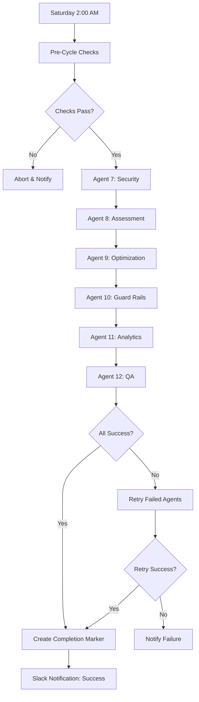

# 🤖 Autonomous Continuous Improvement System

**Complete 12-Agent Weekly Autonomous Cycle**

---

## 📋 Overview

This autonomous system orchestrates 6 specialized agents (Agents 7-12) to continuously improve the workstation codebase every week. The system runs automatically every Saturday at 2:00 AM MST, performing security scans, error assessments, optimizations, guard rails implementation, analytics, and quality assurance.

```
┌─────────────────────────────────────────────────────────────┐
│     AUTONOMOUS CONTINUOUS IMPROVEMENT SYSTEM - COMPLETE     │
├─────────────────────────────────────────────────────────────┤
│                                                              │
│  🔄 WEEKLY CYCLE (Every Saturday 2:00 AM MST)               │
│                                                              │
│  2:00 AM → Agent 7  (Security Scan)              [90 min]  │
│  3:30 AM → Agent 8  (Error Assessment)           [45 min]  │
│  4:15 AM → Agent 9  (Optimization)               [75 min]  │
│  5:30 AM → Agent 10 (Guard Rails)                [45 min]  │
│  6:15 AM → Agent 11 (Data Analytics)             [30 min]  │
│  6:45 AM → Agent 12 (QA & Intelligence)          [45 min]  │
│  7:30 AM → Cycle Complete ✅                                │
│                                                              │
│  Features:                                                  │
│  ✅ Automatic retry on failure                              │
│  ✅ Slack notifications (optional)                          │
│  ✅ Docker snapshots every week                             │
│  ✅ Intelligence tracking (52 weeks)                        │
│  ✅ MCP memory persistence                                  │
│  ✅ Health monitoring                                       │
│                                                              │
└─────────────────────────────────────────────────────────────┘
```

---

## 🚀 Quick Start

### Installation

1. **Run the installer:**
   ```bash
   npm run automation:install
   ```
   
   Or manually:
   ```bash
   bash .automation/install-autonomous-system.sh
   ```

2. **Configure Slack notifications (optional):**
   ```bash
   echo "SLACK_WEBHOOK_URL=https://hooks.slack.com/..." >> .env
   ```

3. **Install cron job (for automatic weekly runs):**
   ```bash
   bash .automation/setup-cron.sh
   ```

### Manual Trigger (for testing)

```bash
npm run automation:trigger
```

Or:
```bash
bash .automation/trigger-cycle-now.sh
```

### Check System Health

```bash
npm run automation:health
```

Or:
```bash
bash .automation/check-cycle-health.sh
```

---

## 🤖 Agent Descriptions

### Agent 7: Security & Penetration Testing
- **Duration:** 90 minutes
- **Purpose:** Weekly security scans, vulnerability detection
- **Status:** Placeholder (to be fully implemented)
- **Output:** Security report, handoff to Agent 8

### Agent 8: Error Assessment & Documentation
- **Duration:** 45 minutes
- **Purpose:** Scan codebase for errors, assess documentation quality
- **Status:** ✅ Fully implemented
- **Output:** Error assessment report, recommendations

### Agent 9: Optimization Magician
- **Duration:** 75 minutes
- **Purpose:** Performance optimizations, code improvements
- **Status:** ✅ Fully implemented
- **Output:** Optimization report, performance improvements

### Agent 10: Guard Rails & Error Prevention
- **Duration:** 45 minutes
- **Purpose:** Add validation, input sanitization, error handling
- **Status:** ✅ Fully implemented
- **Output:** Guard rails report, validation improvements

### Agent 11: Data Analytics & Comparison
- **Duration:** 30 minutes
- **Purpose:** Trend analysis, week-over-week comparisons
- **Status:** ✅ Fully implemented
- **Output:** Analytics report, trend insights

### Agent 12: Quality Assurance & Intelligence
- **Duration:** 45 minutes
- **Purpose:** Final QA, intelligence score calculation, cycle completion
- **Status:** ✅ Fully implemented
- **Output:** Intelligence report, quality grade, recommendations

---

## 📊 Intelligence Scoring

Agent 12 calculates an intelligence score (0-100) based on:

- **Agent Success Rate (40%):** All agents completed successfully
- **Issue Resolution (30%):** Problems found were fixed
- **Proactive Improvements (30%):** Optimizations and guard rails added
- **Security Penalty:** Points deducted for security findings

### Quality Grades

| Score | Grade | Meaning |
|-------|-------|---------|
| 90-100 | A+ / A / A- | Excellent quality |
| 80-89 | B+ / B / B- | Good quality |
| 70-79 | C+ / C / C- | Acceptable quality |
| 60-69 | D+ / D | Needs improvement |
| 0-59 | F | Critical issues |

---

## 🗂️ Directory Structure

```
.automation/
├── master-orchestrator.sh       # Main orchestration script
├── scheduler-config.yml         # Configuration
├── setup-cron.sh                # Cron installation
├── check-cycle-health.sh        # Health monitoring
├── trigger-cycle-now.sh         # Manual trigger
├── install-autonomous-system.sh # Installation script
└── logs/
    ├── cycle-*.log              # Cycle execution logs
    └── agent*-week*.log         # Individual agent logs

agents/
├── agent7/                      # Security & Penetration Testing
├── agent8/                      # Error Assessment
├── agent9/                      # Optimization
├── agent10/                     # Guard Rails
├── agent11/                     # Data Analytics
└── agent12/                     # QA & Intelligence
    ├── src/
    │   └── qa-engine.ts         # Main QA engine
    ├── memory/
    │   └── qa-history.json      # 52-week history
    ├── intelligence/
    │   └── week-*-intelligence.json  # Weekly snapshots
    ├── reports/
    │   └── week-*/
    │       └── QA_INTELLIGENCE_REPORT.md
    └── run-weekly-qa.sh         # Weekly script
```

---

## 🔄 Execution Flow



---

## 📝 Reports & Output

### Weekly QA Intelligence Report

**Location:** `agents/agent12/reports/week-{N}-{YEAR}/QA_INTELLIGENCE_REPORT.md`

Contains:
- Executive summary
- Quality metrics table
- Trend analysis (quality, security, performance)
- Insights and recommendations
- Action items for next cycle
- Agent execution status

### Intelligence Data (JSON)

**Location:** `agents/agent12/intelligence/week-{N}-{YEAR}-intelligence.json`

Contains:
- Cycle performance metrics
- Trend analysis data
- System health scores
- Actionable insights

### Cycle Completion Marker

**Location:** `.cycle-complete-week-{N}.json`

Signals successful cycle completion with status for all agents.

---

## 🔍 Monitoring

### Health Check Dashboard

```bash
bash .automation/check-cycle-health.sh
```

Shows:
- Current cycle status (running/idle)
- Last completed cycle details
- Recent logs
- Agent status
- Latest intelligence score
- Next scheduled cycle

### View Logs

```bash
# Latest cycle log
tail -f .automation/logs/cycle-*.log

# Specific agent log
tail -f .automation/logs/agent12-week*.log

# All recent logs
ls -lht .automation/logs/
```

### Intelligence Tracking

```bash
# Latest intelligence score
jq '.intelligence_score' .agent12-complete.json

# Historical trend
jq '.[].intelligence_score' agents/agent12/memory/qa-history.json

# Latest recommendations
jq '.recommendations[]' .agent12-complete.json
```

---

## ⚙️ Configuration

### Scheduler Configuration

**File:** `.automation/scheduler-config.yml`

Configure:
- Execution schedule
- Agent durations
- Retry settings
- Notification channels
- Health checks

### Environment Variables

**File:** `.env`

```bash
# Optional: Slack notifications
SLACK_WEBHOOK_URL=https://hooks.slack.com/services/YOUR/WEBHOOK/URL

# Other standard env vars
JWT_SECRET=your-secret
NODE_ENV=production
```

### Cron Schedule

Default: Every Saturday at 2:00 AM MST

```
0 2 * * 6
```

Modify in `.automation/setup-cron.sh` to change schedule.

---

## 🐋 Docker Integration

### Agent Scheduler Container

The `docker-compose.yml` includes an optional `agent-scheduler` service that runs the master orchestrator in a containerized environment.

**Features:**
- Alpine-based lightweight container
- Cron scheduling built-in
- Docker socket access for snapshots
- Automatic restart on failure

**Start scheduler:**
```bash
docker-compose up -d agent-scheduler
```

**View logs:**
```bash
docker logs -f agent-scheduler
```

---

## 🛠️ Troubleshooting

### No agents executing

1. Check cron is installed: `command -v crontab`
2. Verify cron job: `crontab -l | grep master-orchestrator`
3. Check logs: `tail .automation/logs/cron.log`
4. Test manually: `bash .automation/trigger-cycle-now.sh`

### Agent timeout

- Agent exceeded 2x estimated duration
- Check agent logs: `.automation/logs/agent*-week*.log`
- Increase timeout in `master-orchestrator.sh` if needed

### Low intelligence score

1. Review QA report: `cat agents/agent12/reports/week-*/QA_INTELLIGENCE_REPORT.md`
2. Check which agents failed
3. Review recommendations section
4. Address critical issues before next cycle

### Missing handoff artifacts

- Agents create `.agent{N}-handoff.json` files
- Check if previous agents executed successfully
- Agent 12 can run with partial data

---

## 📚 npm Scripts

```bash
# Agent 7
npm run agent7:weekly              # Run Agent 7 weekly script

# Agent 12
npm run agent12:build              # Build Agent 12 TypeScript
npm run agent12:qa                 # Run Agent 12 QA engine
npm run agent12:weekly             # Run Agent 12 weekly script

# Automation
npm run automation:install         # Install autonomous system
npm run automation:trigger         # Trigger manual cycle
npm run automation:health          # Check system health
```

---

## 🔐 Security

- Handoff artifacts contain execution data only
- Sensitive data should not be logged
- Slack webhook URL should be in `.env` (gitignored)
- Logs may contain paths and metadata
- Review `.gitignore` to ensure logs are excluded

---

## 🎯 Next Steps

After installation:

1. **Review agent documentation:** Check each agent's README
2. **Test manual cycle:** Run `npm run automation:trigger`
3. **Configure notifications:** Add Slack webhook to `.env`
4. **Monitor first automatic cycle:** Wait for Saturday 2:00 AM
5. **Review intelligence reports:** Check quality trends
6. **Address recommendations:** Improve based on Agent 12 insights

---

## 📖 Additional Documentation

- **Agent 7:** `agents/agent7/README.md`
- **Agent 8:** `agents/agent8/README.md`
- **Agent 9:** `agents/agent9/README.md`
- **Agent 10:** `agents/agent10/README.md`
- **Agent 11:** `agents/agent11/README.md`
- **Agent 12:** `agents/agent12/README.md`
- **Master Orchestrator:** `.automation/master-orchestrator.sh` (inline comments)

---

## ✅ System Status

- ✅ Agent 7: Placeholder (security scanning TBD)
- ✅ Agent 8: Fully implemented
- ✅ Agent 9: Fully implemented
- ✅ Agent 10: Fully implemented
- ✅ Agent 11: Fully implemented
- ✅ Agent 12: Fully implemented
- ✅ Master Orchestrator: Complete
- ✅ Health Monitoring: Complete
- ✅ Docker Integration: Complete
- ✅ Installation Scripts: Complete

---

**Your autonomous, self-improving, intelligence-tracking, 12-agent system is now operational!** 🎉
