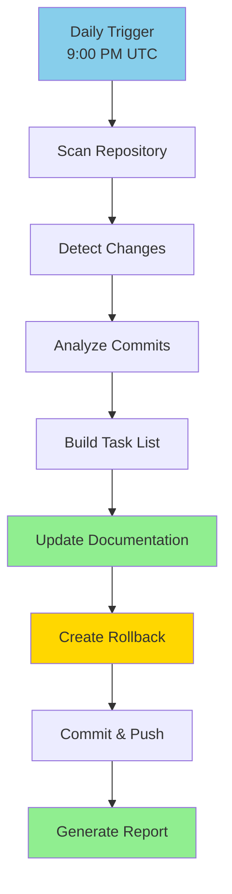

# 📊 Repo Update Agent

**Purpose**: Automated documentation update tracking and synchronization agent  
**Schedule**: Daily at 9:00 PM UTC  
**Status**: ✅ Active

---

## Overview

The Repo Update Agent is an automated system that tracks all repository changes, commits, and activity, then updates documentation to reflect the current state of the repository. It maintains a running task list of completed items and pending documentation updates.

### Key Features

- ✅ **Automated Daily Updates** - Runs at 9:00 PM UTC daily
- ✅ **Change Tracking** - Monitors all commits and activity
- ✅ **Documentation Sync** - Updates README, stats pages, wiki, course materials
- ✅ **Rollback Support** - Maintains rollback files for safe updates
- ✅ **Transparency** - Links to source references for all updates
- ✅ **Task Management** - Running list of completed and pending items

---

## How It Works



---

## Update Targets

The agent updates the following documentation areas:

### 1. Repository Main Page
- `README.md` - Code quality metrics, statistics
- `STATS_OVERVIEW.md` - Quick dashboard
- `REPOSITORY_STATS.md` - Comprehensive statistics

### 2. Code Page Stats
- `BUILD_STATISTICS_AND_IMPACT_ANALYSIS.md`
- `BUILD_STATISTICS_AND_ROI.md`
- Lines of code, file counts, test coverage

### 3. Wiki & Course Pages
- `docs/` directory documentation
- `curriculum/` course materials
- Agent documentation in `agents/`

### 4. Activity Timeline
- `ACTIVITY_TIMELINE.md` - Development timeline
- `ROADMAP_PROGRESS.md` - Phase completion tracking
- `PROJECT_TIMELINE.md` - Historical milestones

---

## Task Tracking

The agent maintains a task list in `REPO_UPDATE_TASKS.md` with the following format:

### Completed Items (Last 24 Hours)

| Time | Type | Change | Documentation Updated | Reference |
|------|------|--------|----------------------|-----------|
| 2025-11-20 16:30 | Code | Chrome extension stats added | ✅ REPOSITORY_STATS.md | [8fc619e](commit) |
| 2025-11-20 16:12 | Docs | Activity timeline created | ✅ ACTIVITY_TIMELINE.md | [1c2d771](commit) |
| 2025-11-20 16:09 | Stats | Repository stats created | ✅ REPOSITORY_STATS.md | [23668ee](commit) |

### Pending Updates

| Item | Affected Docs | Priority | Scheduled | Reference |
|------|---------------|----------|-----------|-----------|
| - | - | - | Next run: 2025-11-21 21:00 UTC | - |

---

## Schedule

**Daily Execution**: 9:00 PM UTC (21:00)

This timing ensures:
- ✅ Captures all daily development activity
- ✅ Updates reflect same-day commits
- ✅ Documentation stays synchronized
- ✅ Stakeholders see current stats each morning

**Timezone Conversions**:
- 9:00 PM UTC
- 4:00 PM EST (US East Coast)
- 1:00 PM PST (US West Coast)
- 10:00 PM CET (Central Europe)

---

## Rollback System

Each update creates a rollback file:

### Rollback Files Location
```
rollbacks/
├── 2025-11-20_README.md.bak
├── 2025-11-20_REPOSITORY_STATS.md.bak
├── 2025-11-20_STATS_OVERVIEW.md.bak
└── rollback-index.json
```

### Rollback Command
```bash
# Rollback to previous day's documentation
./scripts/repo-update-agent/rollback.sh 2025-11-20

# Rollback specific file
./scripts/repo-update-agent/rollback.sh 2025-11-20 README.md
```

---

## Configuration

### Environment Variables

```bash
# Required
GITHUB_TOKEN=your_github_token_here

# Optional
REPO_UPDATE_SCHEDULE="0 21 * * *"  # Cron format (9 PM daily)
REPO_UPDATE_TIMEZONE="UTC"
REPO_UPDATE_DRY_RUN="false"
```

### Config File: `repo-update-agent.json`

```json
{
  "schedule": {
    "time": "21:00",
    "timezone": "UTC",
    "days": ["*"]
  },
  "targets": [
    "README.md",
    "STATS_OVERVIEW.md",
    "REPOSITORY_STATS.md",
    "BUILD_STATISTICS_AND_IMPACT_ANALYSIS.md",
    "ACTIVITY_TIMELINE.md",
    "ROADMAP_PROGRESS.md"
  ],
  "rollback": {
    "enabled": true,
    "retention_days": 30,
    "directory": "rollbacks/"
  },
  "tracking": {
    "task_list": "REPO_UPDATE_TASKS.md",
    "link_commits": true,
    "link_prs": true
  }
}
```

---

## Manual Execution

You can manually trigger the agent:

```bash
# Run update now
npm run repo-update

# Dry run (preview changes)
npm run repo-update -- --dry-run

# Update specific targets only
npm run repo-update -- --targets README.md,STATS_OVERVIEW.md
```

---

## Output Reports

After each run, the agent generates:

### 1. Update Summary (`repo-update-summary.md`)
```markdown
# Repo Update Summary - 2025-11-20 21:00 UTC

## Changes Detected
- 5 new commits
- 12 files changed
- 847 lines added

## Documentation Updated
✅ README.md - Updated code quality metrics
✅ REPOSITORY_STATS.md - Added 3 new sections
✅ STATS_OVERVIEW.md - Updated dashboard
✅ ACTIVITY_TIMELINE.md - Added recent milestones

## Rollback Created
📁 rollbacks/2025-11-20/

## Next Run
⏰ 2025-11-21 21:00 UTC
```

### 2. Task List (`REPO_UPDATE_TASKS.md`)
- Completed items with links
- Pending updates
- Next scheduled run

### 3. Rollback Index (`rollbacks/rollback-index.json`)
- Timestamped backups
- File mappings
- Restore commands

---

## Architecture

### Components

1. **Scanner** (`src/scanner.ts`)
   - Detects repository changes
   - Analyzes commits and diffs
   - Identifies documentation impact

2. **Analyzer** (`src/analyzer.ts`)
   - Calculates statistics
   - Tracks lines of code
   - Monitors file counts

3. **Updater** (`src/updater.ts`)
   - Updates documentation files
   - Maintains consistency
   - Preserves formatting

4. **Rollback Manager** (`src/rollback.ts`)
   - Creates backups
   - Manages retention
   - Provides restore functionality

5. **Task Tracker** (`src/tracker.ts`)
   - Maintains task list
   - Links to references
   - Tracks completion status

---

## Integration

### GitHub Actions Workflow

The agent runs via `.github/workflows/repo-update-agent.yml`:

```yaml
name: Repo Update Agent

on:
  schedule:
    - cron: '0 21 * * *'  # 9 PM UTC daily
  workflow_dispatch:       # Manual trigger

jobs:
  update-docs:
    runs-on: ubuntu-latest
    steps:
      - uses: actions/checkout@v4
      - uses: actions/setup-node@v4
        with:
          node-version: '18'
      
      - name: Install dependencies
        run: cd agents/repo-update-agent && npm install
      
      - name: Run repo update agent
        env:
          GITHUB_TOKEN: ${{ secrets.GITHUB_TOKEN }}
        run: npm run repo-update
      
      - name: Commit changes
        run: |
          git config user.name "Repo Update Agent"
          git config user.email "repo-update-agent@github.com"
          git add .
          git commit -m "📊 Daily documentation update - $(date +'%Y-%m-%d %H:%M UTC')" || exit 0
          git push
```

---

## Monitoring

### Health Checks

The agent reports health status:

```bash
# Check agent status
npm run repo-update:health

# Output:
✅ Agent: Active
✅ Schedule: 0 21 * * * (9 PM UTC daily)
✅ Last Run: 2025-11-20 21:00 UTC
✅ Next Run: 2025-11-21 21:00 UTC
✅ Rollbacks: 30 days retention
✅ Tasks: 15 completed, 0 pending
```

### Logs

Logs are stored in `logs/repo-update-agent/`:
- `YYYY-MM-DD.log` - Daily execution logs
- `errors.log` - Error tracking
- `summary.log` - High-level summaries

---

## Troubleshooting

### Common Issues

**Issue: Agent didn't run at scheduled time**
```bash
# Check GitHub Actions logs
gh run list --workflow=repo-update-agent.yml

# Manually trigger
gh workflow run repo-update-agent.yml
```

**Issue: Documentation not updating**
```bash
# Check for uncommitted changes
git status

# Review agent logs
cat logs/repo-update-agent/$(date +%Y-%m-%d).log
```

**Issue: Need to rollback**
```bash
# List available rollbacks
ls -la rollbacks/

# Restore from specific date
./scripts/repo-update-agent/rollback.sh 2025-11-20
```

---

## Development

### Project Structure

```
agents/repo-update-agent/
├── README.md              # This file
├── package.json           # Dependencies
├── tsconfig.json          # TypeScript config
├── repo-update-agent.json # Configuration
├── src/
│   ├── index.ts          # Main entry point
│   ├── scanner.ts        # Change detection
│   ├── analyzer.ts       # Statistics calculation
│   ├── updater.ts        # Documentation updates
│   ├── rollback.ts       # Backup management
│   └── tracker.ts        # Task list management
├── scripts/
│   ├── run.sh            # Run script
│   └── rollback.sh       # Rollback script
├── tests/
│   └── *.test.ts         # Test suites
└── logs/                 # Execution logs
```

### Adding New Update Targets

Edit `repo-update-agent.json`:

```json
{
  "targets": [
    "README.md",
    "STATS_OVERVIEW.md",
    "your-new-file.md"  // Add here
  ]
}
```

---

## Maintenance

### Regular Tasks

- **Weekly**: Review update accuracy
- **Monthly**: Clean old rollback files
- **Quarterly**: Update agent configuration
- **Annually**: Review and optimize schedule

### Updating the Agent

```bash
cd agents/repo-update-agent
git pull origin main
npm install
npm run build
```

---

## Security

### Best Practices

- ✅ Use GitHub token with minimal required permissions
- ✅ Store secrets in GitHub Secrets, not in code
- ✅ Enable rollback for all updates
- ✅ Review changes before auto-commit
- ✅ Limit agent access to documentation files only

### Required Permissions

```yaml
permissions:
  contents: write    # Update files
  pull-requests: read  # Detect PR activity
  issues: read       # Track issue references
```

---

## Support

### Getting Help

- 📖 Documentation: This README
- 🐛 Issues: [GitHub Issues](https://github.com/creditXcredit/workstation/issues)
- 💬 Discussions: [GitHub Discussions](https://github.com/creditXcredit/workstation/discussions)

### Contributing

Contributions welcome! Please:
1. Fork the repository
2. Create a feature branch
3. Add tests for new functionality
4. Submit a pull request

---

**Last Updated**: 2025-11-20  
**Version**: 1.0.0  
**Status**: ✅ Active & Production Ready

---

*Automated by the Repo Update Agent - Keeping documentation synchronized with code progression*
