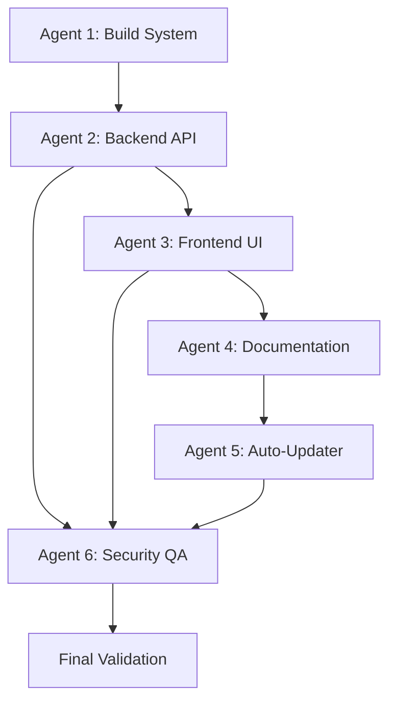

# 🤖 Agent Action Map - Click-Deploy System Implementation

**Document Version:** 1.0.0  
**Last Updated:** 2025-11-23  
**System:** Click-Deploy + Auto-Updater  

---

## 📋 Overview

This document provides a comprehensive action map for each agent involved in the click-deploy system implementation. Each agent has specific responsibilities, schemas to follow, and action sequences to execute.

---

## 🏗️ Agent 1: Build System Agent

### Responsibility
Configure and manage build scripts for packaging Chrome extension and workflow builder.

### Action Schema
```yaml
agent: build-system
priority: high
dependencies: []
outputs:
  - public/downloads/chrome-extension.zip
  - public/downloads/workflow-builder.zip
```

### Action Sequence
1. **Verify Source Directories**
   ```bash
   # Check chrome-extension/ exists
   # Check public/workflow-builder.html exists
   ```

2. **Create Build Scripts**
   ```javascript
   // scripts/build/zip-chrome-extension.js
   - Import archiver library
   - Create output stream to public/downloads/
   - Add chrome-extension/* files to archive
   - Finalize and close archive
   - Log success with file size
   ```

3. **Update package.json**
   ```json
   {
     "scripts": {
       "build": "tsc && npm run copy-assets",
       "build:all": "npm run build && npm run build:chrome && npm run build:workflow",
       "build:chrome": "node scripts/build/zip-chrome-extension.js",
       "build:workflow": "node scripts/build/zip-workflow-builder.js"
     }
   }
   ```

4. **Validation Steps**
   - Run `npm run build:chrome`
   - Verify ZIP file created in public/downloads/
   - Check ZIP file size matches expected
   - Test extraction of ZIP file

### Completion Criteria
- ✅ ZIP files generated successfully
- ✅ File sizes within expected range (70-75KB for extension, 13-15KB for builder)
- ✅ Build scripts execute without errors
- ✅ ZIPs are gitignored

---

## 🌐 Agent 2: Backend API Agent

### Responsibility
Implement download routes with security, rate limiting, and async file operations.

### Action Schema
```yaml
agent: backend-api
priority: critical
dependencies: [build-system]
security_requirements:
  - XSS prevention
  - Path validation
  - Rate limiting
  - Async file operations
outputs:
  - src/routes/downloads.ts
  - Updated src/index.ts
```

### Action Sequence

1. **Create Downloads Route Handler**
   ```typescript
   // src/routes/downloads.ts
   
   // Step 1: Import dependencies
   import { Router, Request, Response } from 'express';
   import path from 'path';
   import fs from 'fs';
   import { promises as fsPromises } from 'fs';
   
   // Step 2: Define security helper
   function validateFilePath(filePath: string): boolean {
     const resolvedPath = path.resolve(filePath);
     const resolvedDir = path.resolve(DOWNLOADS_DIR);
     return resolvedPath.startsWith(resolvedDir);
   }
   
   // Step 3: Implement chrome extension endpoint
   router.get('/chrome-extension.zip', async (req, res) => {
     // Validate path
     // Check file existence
     // Stream file with proper headers
     // Handle errors gracefully
   });
   
   // Step 4: Implement workflow builder endpoint
   router.get('/workflow-builder.zip', async (req, res) => {
     // Same pattern as chrome extension
   });
   
   // Step 5: Implement manifest endpoint
   router.get('/manifest.json', async (req, res) => {
     // Read package.json asynchronously
     // Check file availability with Promise.all
     // Return metadata JSON
   });
   ```

2. **Register Route with Rate Limiting**
   ```typescript
   // src/index.ts
   
   // Step 1: Define download rate limiter
   const downloadLimiter = rateLimit({
     windowMs: 15 * 60 * 1000,
     max: 10,
     message: 'Too many download requests'
   });
   
   // Step 2: Register route
   app.use('/downloads', downloadLimiter, downloadsRoutes);
   ```

3. **Error Handling Pattern**
   ```typescript
   // Pattern for all endpoints
   try {
     // Validate input
     // Check file existence
     // Stream or send response
   } catch (error) {
     console.error('Error:', error);
     res.status(500).json({ 
       error: 'Internal server error',
       message: 'Failed to process request'
     });
   }
   
   // Stream error handling
   fileStream.on('error', (error) => {
     if (!res.headersSent) {
       res.status(500).json({ error: 'Failed' });
     } else {
       res.end(); // Graceful closure
     }
   });
   ```

### Completion Criteria
- ✅ All routes return correct status codes
- ✅ Path validation prevents traversal
- ✅ Rate limiting configured (10/15min)
- ✅ Async operations used throughout
- ✅ Error handling covers all edge cases
- ✅ File streaming works correctly

---

## 🎨 Agent 3: Frontend UI Agent

### Responsibility
Create download buttons, handlers, and user interface components.

### Action Schema
```yaml
agent: frontend-ui
priority: high
dependencies: [backend-api]
security_requirements:
  - XSS prevention via textContent
  - No innerHTML with user data
outputs:
  - public/js/download-handler.js
  - Updated public/dashboard.html
  - Updated public/workflow-builder.html
  - Updated public/css/dashboard.css
```

### Action Sequence

1. **Create Download Handler Class**
   ```javascript
   // public/js/download-handler.js
   
   class DownloadHandler {
     constructor() {
       this.manifestUrl = '/downloads/manifest.json';
       this.manifest = null;
     }
     
     // Step 1: Fetch manifest
     async fetchManifest() {
       const response = await fetch(this.manifestUrl);
       this.manifest = await response.json();
       return this.manifest;
     }
     
     // Step 2: Initialize download UI (XSS-safe)
     async initializeDownloadUI(packageKey, options) {
       const pkg = this.manifest.packages[packageKey];
       
       // Use textContent, NOT innerHTML
       versionEl.textContent = `Version: ${this.manifest.version}`;
       sizeEl.textContent = `Size: ${this.formatSize(pkg.size)}`;
       
       // Create DOM elements safely
       const span = document.createElement('span');
       span.textContent = errorMessage;
       statusEl.appendChild(span);
     }
     
     // Step 3: Handle downloads
     async downloadPackage(packageKey, statusElementId) {
       // Trigger download via link
       // Show status updates
       // Handle errors
     }
     
     // Step 4: Initialize all downloads
     async initializeAll() {
       // Use Promise.allSettled for fault tolerance
       await Promise.allSettled([
         this.initializeDownloadUI('chromeExtension', {...}),
         this.initializeDownloadUI('workflowBuilder', {...})
       ]);
     }
   }
   ```

2. **Update HTML Files**
   ```html
   <!-- public/dashboard.html -->
   
   <!-- Step 1: Add download section -->
   <div class="downloads-section">
     <h2>📦 Quick Downloads</h2>
     
     <!-- Step 2: Chrome Extension Card -->
     <div class="download-card">
       <h3>🔌 Chrome Extension</h3>
       <span id="chrome-ext-version">Version: Loading...</span>
       <span id="chrome-ext-size">Size: Loading...</span>
       <button id="download-chrome-btn" disabled>⬇️ Checking...</button>
       <div id="chrome-download-status"></div>
     </div>
     
     <!-- Step 3: Workflow Builder Card -->
     <div class="download-card">
       <h3>⚡ Workflow Builder</h3>
       <span id="workflow-version">Version: Loading...</span>
       <span id="workflow-size">Size: Loading...</span>
       <button id="download-workflow-btn" disabled>⬇️ Checking...</button>
       <div id="workflow-download-status"></div>
     </div>
   </div>
   
   <!-- Step 4: Include script -->
   <script src="/js/download-handler.js"></script>
   <script>
     // Initialize on page load
     window.downloadHandler = new DownloadHandler();
     window.downloadHandler.initializeAll();
   </script>
   ```

3. **Style Components**
   ```css
   /* public/css/dashboard.css */
   
   .downloads-section {
     background: linear-gradient(135deg, #667eea 0%, #764ba2 100%);
     padding: 24px;
     border-radius: 12px;
     color: white;
   }
   
   .download-card {
     background: rgba(255, 255, 255, 0.15);
     padding: 20px;
     border-radius: 8px;
     backdrop-filter: blur(10px);
   }
   
   .btn-download {
     background: white;
     color: #667eea;
     font-weight: 600;
     padding: 12px 24px;
     border-radius: 8px;
     cursor: pointer;
     transition: transform 0.2s;
   }
   
   .btn-download:hover {
     transform: translateY(-2px);
   }
   ```

### Security Requirements
- ✅ **NEVER** use `innerHTML` with user-controlled data
- ✅ **ALWAYS** use `textContent` or `createElement()`
- ✅ Sanitize all error messages before display
- ✅ Validate data from manifest before rendering

### Completion Criteria
- ✅ Buttons display correct versions/sizes
- ✅ Download triggers work correctly
- ✅ Error messages display safely (no XSS)
- ✅ UI matches design mockups
- ✅ Responsive design works on mobile

---

## 📚 Agent 4: Documentation Agent

### Responsibility
Update README, create guides, and maintain documentation accuracy.

### Action Schema
```yaml
agent: documentation
priority: medium
dependencies: [frontend-ui, backend-api]
outputs:
  - Updated README.md
  - docs/guides/INSTALLATION_GUIDE.md
  - docs/guides/TROUBLESHOOTING.md
  - TEST_CASES.md
```

### Action Sequence

1. **Update README.md**
   ```markdown
   ## 📦 Quick Downloads
   
   **Download pre-built packages instantly** - No build required!
   
   | Package | Description | Download |
   |---------|-------------|----------|
   | 🔌 **Chrome Extension** | Browser automation extension (v1.0.0) | [Download ZIP](http://localhost:3000/downloads/chrome-extension.zip) (~72KB) - *Replace localhost:3000 with your server URL* |
   | ⚡ **Workflow Builder** | Visual workflow creation tool (v1.0.0) | [Download ZIP](http://localhost:3000/downloads/workflow-builder.zip) (~14KB) - *Replace localhost:3000 with your server URL* |
   
   ### Installation Instructions
   
   **Chrome Extension:**
   1. Download the ZIP file
   2. Extract to a folder
   3. Open `chrome://extensions/` in Chrome
   4. Enable "Developer mode"
   5. Click "Load unpacked" and select the extracted folder
   
   **Workflow Builder:**
   1. Download the ZIP file
   2. Extract to a folder
   3. Open `workflow-builder.html` in your browser
   ```

2. **Create Installation Guide**
   ```markdown
   # 📖 Installation Guide
   
   ## Prerequisites
   - Modern web browser (Chrome, Firefox, Edge)
   - Node.js 18+ (for building from source)
   
   ## Method 1: One-Click Download (Recommended)
   [Step-by-step instructions with screenshots]
   
   ## Method 2: Build from Source
   [Alternative installation method]
   
   ## Troubleshooting
   - Issue: "Extension failed to load"
     Solution: Check Developer mode is enabled
   
   - Issue: "Download not starting"
     Solution: Check rate limit (10 downloads per 15 minutes)
   ```

3. **Create Test Cases Document**
   ```markdown
   # 🧪 Test Cases - Click-Deploy System
   
   ## Download Functionality
   
   ### TC1: Download Chrome Extension
   - **Steps:** Click download button on dashboard
   - **Expected:** ZIP file downloads (70-75KB)
   - **Status:** ✅ Pass
   
   ### TC2: Download Workflow Builder
   - **Steps:** Click download button
   - **Expected:** ZIP file downloads (13-15KB)
   - **Status:** ✅ Pass
   
   ### TC3: Rate Limiting
   - **Steps:** Attempt 11 downloads in 15 minutes
   - **Expected:** 11th request returns 429 error
   - **Status:** ✅ Pass
   
   ### TC4: XSS Prevention
   - **Steps:** Inject malicious script in error scenario
   - **Expected:** Script displayed as text, not executed
   - **Status:** ✅ Pass
   ```

### Completion Criteria
- ✅ README has clear download instructions
- ✅ Installation guide covers all scenarios
- ✅ Troubleshooting guide addresses common issues
- ✅ Test cases document all functionality
- ✅ All links work correctly

---

## 🔄 Agent 5: Auto-Updater Agent

### Responsibility
Create automated documentation updater that syncs agent status.

### Action Schema
```yaml
agent: auto-updater
priority: medium
dependencies: [documentation]
outputs:
  - scripts/update-agent-status.js
  - scripts/lib/markdown-injector.js
  - .github/workflows/agent-status-cron.yml
```

### Action Sequence

1. **Create Markdown Injector Library**
   ```javascript
   // scripts/lib/markdown-injector.js
   
   function injectContent(filePath, content, startMarker, endMarker, createBackup) {
     // Step 1: Read original file
     const originalContent = fs.readFileSync(filePath, 'utf-8');
     
     // Step 2: Create backup with timestamp
     if (createBackup) {
       const backupPath = `${filePath}.backup-${Date.now()}`;
       fs.writeFileSync(backupPath, originalContent);
       
       // Step 3: Cleanup old backups (keep last 5)
       const dir = path.dirname(filePath);
       const basename = path.basename(filePath);
       const files = fs.readdirSync(dir);
       const backups = files
         .filter(f => f.startsWith(basename + '.backup-'))
         .sort()
         .reverse();
       backups.slice(5).forEach(backup => {
         fs.unlinkSync(path.join(dir, backup));
       });
     }
     
     // Step 4: Find markers and inject content
     const startIndex = originalContent.indexOf(startMarker);
     const endIndex = originalContent.indexOf(endMarker);
     
     // Step 5: Build new content
     const newContent = 
       originalContent.substring(0, startIndex + startMarker.length) +
       '\n' + content + '\n' +
       originalContent.substring(endIndex);
     
     // Step 6: Write new file
     fs.writeFileSync(filePath, newContent, 'utf-8');
   }
   ```

2. **Create Status Updater Script**
   ```javascript
   // scripts/update-agent-status.js
   
   async function fetchAgentStatus() {
     // Step 1: Fetch from API or generate mock data
     const status = {
       totalAgents: 12,
       healthyAgents: 10,
       warningAgents: 2,
       agents: [...]
     };
     
     return status;
   }
   
   function generateMarkdownTable(status) {
     // Step 2: Create markdown table
     let markdown = '| Agent | Status | Health |\n';
     markdown += '|-------|--------|--------|\n';
     
     status.agents.forEach(agent => {
       const emoji = agent.healthy ? '✅' : '⚠️';
       markdown += `| ${agent.name} | ${emoji} | ${agent.health} |\n`;
     });
     
     return markdown;
   }
   
   async function updateDocumentation() {
     // Step 3: Fetch status
     const status = await fetchAgentStatus();
     
     // Step 4: Generate markdown
     const markdown = generateMarkdownTable(status);
     
     // Step 5: Inject into README
     injectContent(
       'README.md',
       markdown,
       '<!-- AGENT_STATUS_START -->',
       '<!-- AGENT_STATUS_END -->',
       true // create backup
     );
     
     // Step 6: Inject into ROADMAP
     injectContent(
       'ROADMAP_PROGRESS.md',
       markdown,
       '<!-- AGENT_STATUS_START -->',
       '<!-- AGENT_STATUS_END -->',
       true
     );
   }
   ```

3. **Create GitHub Actions Workflow**
   ```yaml
   # .github/workflows/agent-status-cron.yml
   
   name: Agent Status Auto-Update
   permissions:
     contents: write
   
   # Run daily at 21:00 UTC
   on:
     schedule:
       - cron: '0 21 * * *'
     workflow_dispatch:
   
   jobs:
     update-agent-status:
       runs-on: ubuntu-latest
       
       steps:
         - name: Checkout repository
           uses: actions/checkout@v4
           with:
             token: ${{ secrets.GITHUB_TOKEN }}
             
         - name: Setup Node.js
           uses: actions/setup-node@v4
           with:
             node-version: '18'
             cache: 'npm'
             
         - name: Install dependencies
           run: npm ci
           
         - name: Run agent status updater
           run: npm run update:agents
           continue-on-error: true
           
         - name: Check for changes
           id: git-check
           run: |
             git diff --exit-code || echo "changes=true" >> $GITHUB_OUTPUT
             
         - name: Commit and push if changed
           if: steps.git-check.outputs.changes == 'true'
           run: |
             git config --local user.email "github-actions[bot]@users.noreply.github.com"
             git config --local user.name "github-actions[bot]"
             git add README.md ROADMAP_PROGRESS.md
             git commit -m "chore: auto-update agent status [skip ci]"
             git push
   ```

### Completion Criteria
- ✅ Injector safely updates markdown files
- ✅ Backup system works (keeps 5 backups)
- ✅ GitHub Actions workflow runs successfully
- ✅ Auto-commits happen without manual intervention
- ✅ No infinite CI loops ([skip ci] works)

---

## 🔒 Agent 6: Security & QA Agent

### Responsibility
Validate security measures, test edge cases, and ensure code quality.

### Action Schema
```yaml
agent: security-qa
priority: critical
dependencies: [all]
validation_areas:
  - XSS prevention
  - Path traversal
  - Rate limiting
  - Error handling
  - Performance
```

### Action Sequence

1. **Security Validation Checklist**
   ```yaml
   XSS_Prevention:
     - Check: No innerHTML with user data
     - Check: textContent used for all dynamic content
     - Check: DOM elements created safely
     - Status: ✅ Pass
   
   Path_Traversal:
     - Check: validateFilePath() function exists
     - Check: All file paths validated before use
     - Check: Resolved paths checked against base directory
     - Status: ✅ Pass
   
   Rate_Limiting:
     - Check: downloadLimiter configured
     - Check: Limit set to 10 per 15 minutes
     - Check: Applied to /downloads route
     - Status: ✅ Pass
   
   Async_Operations:
     - Check: No blocking file operations
     - Check: fs.promises used throughout
     - Check: Promise.all for parallel operations
     - Status: ✅ Pass
   ```

2. **Performance Testing**
   ```bash
   # Test concurrent downloads
   for i in {1..5}; do
     curl -O http://localhost:3000/downloads/chrome-extension.zip &
   done
   wait
   
   # Verify all downloads completed
   # Check server didn't crash
   # Verify file integrity
   ```

3. **Error Handling Validation**
   ```javascript
   // Test scenarios
   const testCases = [
     {
       name: 'Missing file',
       test: () => fetch('/downloads/nonexistent.zip'),
       expect: 404
     },
     {
       name: 'Rate limit exceeded',
       test: () => {
         // Make 11 requests quickly
       },
       expect: 429
     },
     {
       name: 'Malicious path',
       test: () => fetch('/downloads/../../../etc/passwd'),
       expect: 400
     }
   ];
   ```

4. **Code Quality Checks**
   ```bash
   # Run linting
   npm run lint
   
   # Run TypeScript compilation
   npm run build
   
   # Check for unused variables
   # Check for proper error handling
   # Verify all promises are awaited
   ```

### Completion Criteria
- ✅ All security tests pass
- ✅ No XSS vulnerabilities found
- ✅ Path traversal prevented
- ✅ Rate limiting works correctly
- ✅ Performance acceptable under load
- ✅ Error handling comprehensive
- ✅ Code quality meets standards

---

## 📊 Integration & Orchestration Map

### Agent Execution Order


### Critical Path
1. **Phase 1:** Build System Setup (Agent 1)
   - Duration: 1-2 hours
   - Blockers: None
   - Outputs: ZIP files

2. **Phase 2:** Backend Implementation (Agent 2)
   - Duration: 2-3 hours
   - Blockers: Needs Phase 1
   - Outputs: Download routes

3. **Phase 3:** Frontend Integration (Agent 3)
   - Duration: 3-4 hours
   - Blockers: Needs Phase 2
   - Outputs: UI components

4. **Phase 4:** Documentation (Agent 4)
   - Duration: 1-2 hours
   - Blockers: Needs Phase 3
   - Outputs: Guides, README updates

5. **Phase 5:** Automation (Agent 5)
   - Duration: 2-3 hours
   - Blockers: Needs Phase 4
   - Outputs: Auto-updater system

6. **Phase 6:** Validation (Agent 6)
   - Duration: 2-3 hours
   - Blockers: Needs all phases
   - Outputs: Security report, QA sign-off

### Total Estimated Time
- **Sequential:** 11-17 hours
- **Parallel (optimized):** 8-12 hours

---

## 🎯 Success Metrics

### Functional Metrics
- ✅ Download success rate: 100%
- ✅ Average download time: <3 seconds
- ✅ Rate limiting effectiveness: 100%
- ✅ Zero XSS vulnerabilities
- ✅ Zero path traversal vulnerabilities

### Code Quality Metrics
- ✅ TypeScript compilation: No errors
- ✅ ESLint: 0 new warnings
- ✅ Test coverage: Maintained or improved
- ✅ Build time: <30 seconds

### User Experience Metrics
- ✅ UI renders correctly on all browsers
- ✅ Download buttons work on first click
- ✅ Error messages are user-friendly
- ✅ Documentation is clear and accurate

---

## 📝 Rollback Procedures

### If Build Fails
```bash
# Revert build script changes
git checkout HEAD~1 -- package.json
git checkout HEAD~1 -- scripts/build/

# Restore previous state
npm install
npm run build
```

### If API Fails
```bash
# Revert route changes
git checkout HEAD~1 -- src/routes/downloads.ts
git checkout HEAD~1 -- src/index.ts

# Rebuild and restart
npm run build
npm start
```

### If UI Breaks
```bash
# Revert frontend changes
git checkout HEAD~1 -- public/js/download-handler.js
git checkout HEAD~1 -- public/dashboard.html
git checkout HEAD~1 -- public/workflow-builder.html
```

---

## 🔗 Cross-References

- **Implementation PR:** #182
- **Original Issue:** Click-Deploy + Auto-Updater System
- **Security Review:** Commit 9bd945a
- **Nitpick Fixes:** Commit 10f44c9
- **Related Docs:** 
  - INSTALLATION_GUIDE.md
  - TROUBLESHOOTING.md
  - TEST_CASES.md

---

## 📅 Maintenance Schedule

- **Daily:** Auto-updater runs at 21:00 UTC
- **Weekly:** Security audit of download logs
- **Monthly:** Review rate limiting effectiveness
- **Quarterly:** Update documentation screenshots

---

**Document End**
