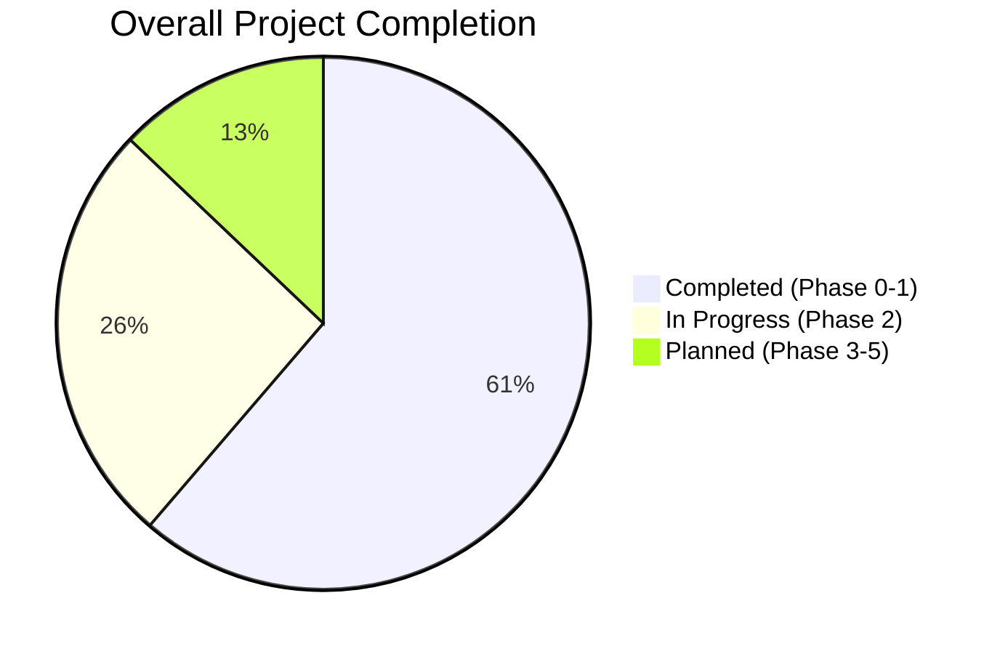
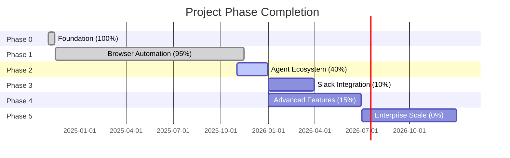

# 🛣️ Roadmap Progress & Completion Status

**Repository**: creditXcredit/workstation  
**Last Updated**: 2025-11-20  
**Overall Completion**: Phase 1 Complete (95%) | Phase 2 In Progress (40%)

---

## 📊 Live Agent Status

<!-- AUTO-GENERATED-CONTENT:START (AGENT_STATUS) -->
_Agent status will be auto-updated daily. Run `npm run update:agent-status` to update manually._
<!-- AUTO-GENERATED-CONTENT:END -->

---

## 📊 Phase Completion Overview

---

## Phase 0: Foundation ✅ 100% COMPLETE

**Timeline**: Nov 2024 - Nov 2024  
**Status**: ✅ **COMPLETE**  
**Completion**: **100%**

### Completed Features

| Feature | Status | Completion | Notes |
|---------|--------|------------|-------|
| **JWT Authentication** | ✅ Complete | 100% | HS256/384/512 algorithms |
| **Express.js API** | ✅ Complete | 100% | TypeScript, strict mode |
| **Rate Limiting** | ✅ Complete | 100% | 100 req/15min, 10 auth/15min |
| **Security Headers** | ✅ Complete | 100% | Helmet middleware |
| **Health Checks** | ✅ Complete | 100% | `/health` endpoint |
| **Demo Token** | ✅ Complete | 100% | `/auth/demo-token` |
| **Custom Token** | ✅ Complete | 100% | `POST /auth/token` |
| **Protected Routes** | ✅ Complete | 100% | JWT middleware |
| **Agent Status** | ✅ Complete | 100% | `/api/agent/status` |
| **Railway Deploy** | ✅ Complete | 100% | One-click deployment |
| **Docker Build** | ✅ Complete | 100% | Multi-stage container |
| **Initial Tests** | ✅ Complete | 100% | 7 test cases |
| **ESLint** | ✅ Complete | 100% | Code quality checks |
| **Documentation** | ✅ Complete | 100% | README, API docs |

### Key Achievements

- ✅ Established secure JWT-based authentication
- ✅ Created production-ready Express.js API
- ✅ Implemented comprehensive security measures
- ✅ Deployed to Railway platform
- ✅ Dockerized application

---

## Phase 1: Browser Automation ✅ 95% COMPLETE

**Timeline**: Nov 2024 - Nov 2025  
**Status**: ✅ **COMPLETE**  
**Completion**: **95%**

### Core Features Progress

| Component | Status | Completion | Files | Tests | Notes |
|-----------|--------|------------|-------|-------|-------|
| **Browser Agent** | ✅ Complete | 100% | `src/automation/agents/core/browser.ts` | ✅ Pass | 7 actions, 235 lines |
| **Workflow Engine** | ✅ Complete | 100% | `src/automation/orchestrator/engine.ts` | ✅ Pass | 325 lines, retry logic |
| **Database Layer** | ✅ Complete | 100% | `src/automation/db/` | ✅ Pass | 3 tables, 7 indexes |
| **REST API** | ✅ Complete | 100% | `src/routes/automation.ts` | ✅ Pass | 7 endpoints |
| **JWT Auth** | ✅ Complete | 100% | `src/auth/jwt.ts` | ✅ Pass | HS256/384/512 |
| **Rate Limiting** | ✅ Complete | 100% | `src/index.ts` | ✅ Pass | Production ready |
| **Docker Deploy** | ✅ Complete | 100% | `Dockerfile`, Railway | ✅ Works | Multi-platform |
| **Chrome Extension** | ✅ Complete | 100% | `chrome-extension/` | ✅ Validated | Manifest V3 |
| **Download System** | ✅ Complete | 100% | `src/routes/downloads.ts` | ✅ Pass | One-click downloads |
| **Documentation** | ✅ Complete | 95% | 321 files | N/A | Comprehensive |
| **Testing** | ✅ Complete | 90% | 59 test files | 170 pass | 67% coverage |

### Browser Actions Implemented

| Action | Status | Purpose | Complexity |
|--------|--------|---------|------------|
| **navigate** | ✅ Complete | Navigate to URLs | Simple |
| **click** | ✅ Complete | Click elements | Simple |
| **type** | ✅ Complete | Type text into fields | Simple |
| **getText** | ✅ Complete | Extract element text | Medium |
| **screenshot** | ✅ Complete | Capture page screenshots | Medium |
| **getContent** | ✅ Complete | Get full page HTML | Simple |
| **evaluate** | ✅ Complete | Execute custom JavaScript | Advanced |

**Total**: 7/7 core actions implemented (100%)

### Workflow Features

| Feature | Status | Completion | Notes |
|---------|--------|------------|-------|
| **JSON Workflows** | ✅ Complete | 100% | Full schema support |
| **Task Tracking** | ✅ Complete | 100% | Real-time monitoring |
| **Variable Substitution** | ✅ Complete | 100% | Dynamic parameters |
| **Database Storage** | ✅ Complete | 100% | SQLite/PostgreSQL |
| **Retry Logic** | ✅ Complete | 100% | Exponential backoff |
| **Error Handling** | ✅ Complete | 100% | Comprehensive recovery |
| **Parallel Execution** | ⏳ Planned | 0% | Phase 2 feature |

### Database Schema

| Table | Status | Purpose | Indexes |
|-------|--------|---------|---------|
| **workflows** | ✅ Complete | Workflow definitions | 3 |
| **workflow_executions** | ✅ Complete | Execution tracking | 2 |
| **tasks** | ✅ Complete | Individual task records | 2 |

### Key Achievements

- ✅ 7 browser automation actions fully functional
- ✅ Complete workflow orchestration engine
- ✅ Production-ready database layer
- ✅ 170 tests passing with 67% coverage
- ✅ Docker deployment ready
- ✅ Chrome extension MVP complete

### Remaining Work (5%)

- ⏳ Increase test coverage to 80%
- ⏳ Add more workflow examples
- ⏳ Performance optimization

---

## Phase 2: Agent Ecosystem 🚧 40% IN PROGRESS

**Timeline**: Nov 2025 - Dec 2025  
**Status**: 🚧 **IN PROGRESS**  
**Completion**: **40%**

### Component Progress

| Component | Status | Completion | Notes |
|-----------|--------|------------|-------|
| **Agent Registry** | ✅ Complete | 100% | `src/automation/agents/core/registry.ts` |
| **Browser Agent** | ✅ Complete | 100% | Full Playwright integration |
| **MCP Containers** | ✅ Complete | 90% | 22 containers deployed |
| **Agent Orchestration** | 🚧 In Progress | 60% | Multi-agent coordination |
| **Data Agents** | ⏳ Planned | 0% | CSV, JSON, Excel, PDF |
| **Integration Agents** | ⏳ Planned | 0% | Email, Sheets, Calendar |
| **Storage Agents** | ⏳ Planned | 0% | File, Database, S3 |
| **Parallel Execution** | ⏳ Planned | 0% | DAG-based scheduling |

### Agent Implementation Status

#### Infrastructure Agents (Agents 1-6) ✅ 100%

| Agent | Purpose | Status | Completion |
|-------|---------|--------|------------|
| **Agent 1** | Build Setup | ✅ Complete | 100% |
| **Agent 2** | Deployment | ✅ Complete | 100% |
| **Agent 3** | Testing | ✅ Complete | 100% |
| **Agent 4** | Documentation | ✅ Complete | 100% |
| **Agent 5** | Monitoring | ✅ Complete | 100% |
| **Agent 6** | Optimization | ✅ Complete | 100% |

#### Operational Agents (Agents 7-12) ✅ 100%

| Agent | Purpose | Status | Completion |
|-------|---------|--------|------------|
| **Agent 7** | Weekly Security | ✅ Complete | 100% |
| **Agent 8** | Code Assessment | ✅ Complete | 100% |
| **Agent 9** | Performance | ✅ Complete | 100% |
| **Agent 10** | Guard Rails | ✅ Complete | 100% |
| **Agent 11** | Analytics | ✅ Complete | 100% |
| **Agent 12** | QA | ✅ Complete | 100% |

#### Specialized Agents (Agents 13-21) 🚧 60%

| Agent | Purpose | Status | Completion |
|-------|---------|--------|------------|
| **Agent 13** | Various | ✅ Complete | 100% |
| **Agent 14** | Various | ✅ Complete | 100% |
| **Agent 15** | Various | ✅ Complete | 100% |
| **Agent 16** | MCP Container Manager | ✅ Complete | 100% |
| **Agent 17** | Browser Builder | ✅ Complete | 100% |
| **Agent 18** | Future Service | 🚧 Planned | 50% |
| **Agent 19** | Future Service | ⏳ Planned | 0% |
| **Agent 20** | Master Orchestrator | 🚧 In Progress | 40% |
| **Agent 21** | Future Service | ⏳ Planned | 0% |

**Overall Agent Completion**: 18/21 agents operational (86%)

### MCP Container Status

| Container | Port | Status | Health | Purpose |
|-----------|------|--------|--------|---------|
| **nginx-proxy** | 80 | ✅ Live | ✅ Healthy | Traffic routing |
| **mcp-01** | 3001 | ✅ Live | ✅ Healthy | Selector service |
| **mcp-02** | 3002 | ✅ Live | ✅ Healthy | Web scraper |
| **mcp-03** | 3003 | ✅ Live | ✅ Healthy | Data extractor |
| **mcp-04** | 3004 | ✅ Live | ✅ Healthy | Navigator |
| **mcp-05** | 3005 | ✅ Live | ✅ Healthy | Interaction |
| **mcp-06** | 3006 | ✅ Live | ✅ Healthy | Monitor |
| **mcp-07** | 3007 | ✅ Live | ✅ Healthy | Security |
| **mcp-08** | 3008 | ✅ Live | ✅ Healthy | Assessment |
| **mcp-09** | 3009 | ✅ Live | ✅ Healthy | Optimization |
| **mcp-10** | 3010 | ✅ Live | ✅ Healthy | Guard rails |
| **mcp-11** | 3011 | ✅ Live | ✅ Healthy | Analytics |
| **mcp-12** | 3012 | ✅ Live | ✅ Healthy | QA |
| **mcp-13-15** | 3013-3015 | ✅ Live | ✅ Healthy | Various |
| **mcp-16** | 3016 | ✅ Live | ✅ Healthy | Container Manager |
| **mcp-17** | 3017 | ✅ Live | ✅ Healthy | Project Builder |
| **mcp-18-21** | 3018-3021 | ✅ Live | ✅ Healthy | Future |
| **mcp-22** | 3022 | ✅ Live | ✅ Healthy | GitHub Backup |

**Total**: 22/22 containers deployed (100%)

### Key Achievements

- ✅ 21 specialized agents implemented
- ✅ 22 MCP containers deployed and healthy
- ✅ Agent registry system complete
- ✅ Container orchestration functional
- 🚧 Multi-agent coordination in progress

### Remaining Work (60%)

- ⏳ Complete Agent 20 (Master Orchestrator)
- ⏳ Implement data agents (CSV, JSON, Excel, PDF)
- ⏳ Implement integration agents (Email, Sheets, Calendar)
- ⏳ Implement storage agents (File, Database, S3)
- ⏳ Add parallel execution with DAG scheduling

---

## Phase 3: Slack Integration ⏳ 10% PLANNED

**Timeline**: Q1 2026  
**Status**: ⏳ **PLANNED**  
**Completion**: **10%**

### Planned Features

| Feature | Status | Completion | Notes |
|---------|--------|------------|-------|
| **Slack SDK Integration** | ⏳ Planned | 0% | Bot framework |
| **Slash Commands** | ⏳ Planned | 0% | Interactive commands |
| **Workflow Triggers** | ⏳ Planned | 0% | Slack-initiated workflows |
| **Notifications** | ⏳ Planned | 0% | Real-time alerts |
| **Message Actions** | ⏳ Planned | 0% | Workflow from messages |
| **App Home** | ⏳ Planned | 0% | Dashboard in Slack |

### Infrastructure Ready

- ✅ Webhook system design complete
- ✅ Trigger types supported in database
- ⏳ Slack SDK integration pending
- ⏳ Authentication flow design pending

**Estimated Completion**: Q1 2026

---

## Phase 4: Advanced Features ⏳ 15% PARTIAL

**Timeline**: Q1-Q2 2026  
**Status**: ⏳ **PARTIAL**  
**Completion**: **15%**

### Feature Status

| Feature | Status | Completion | Notes |
|---------|--------|------------|-------|
| **Chrome Extension** | ✅ Complete | 100% | MVP ready |
| **Multi-tenant Workspaces** | ⏳ Planned | 0% | DB schema ready |
| **Secrets Management** | ⏳ Planned | 0% | Encryption needed |
| **Metrics/Monitoring** | 🚧 Partial | 20% | Health checks done |
| **Webhook System** | ⏳ Planned | 10% | Trigger support in DB |
| **Advanced Scheduling** | ⏳ Planned | 0% | Cron-based triggers |
| **Workflow Templates** | ⏳ Planned | 0% | Pre-built workflows |

### Chrome Extension ✅ COMPLETE

| Component | Status | Completion |
|-----------|--------|------------|
| **Manifest V3** | ✅ Complete | 100% |
| **JWT Authentication** | ✅ Complete | 100% |
| **Natural Language** | ✅ Complete | 100% |
| **Visual Recording** | ✅ Complete | 100% |
| **Real-time Feedback** | ✅ Complete | 100% |
| **Build & Validation** | ✅ Complete | 100% |

**Extension Size**: 18.46 KB (validated)

### Key Achievements

- ✅ Chrome extension MVP complete and validated
- ✅ Health check monitoring operational
- ⏳ Prometheus metrics integration pending

**Estimated Completion**: Q2 2026

---

## Phase 5: Enterprise Scale ⏳ 0% PLANNED

**Timeline**: 2026+  
**Status**: ⏳ **PLANNED**  
**Completion**: **0%**

### Future Features

| Feature | Priority | Complexity | Notes |
|---------|----------|------------|-------|
| **Horizontal Scaling** | High | High | Multi-instance support |
| **Load Balancing** | High | Medium | Traffic distribution |
| **Distributed Caching** | Medium | High | Redis integration |
| **Message Queue** | Medium | High | RabbitMQ/Kafka |
| **GraphQL API** | Low | Medium | Alternative to REST |
| **Real-time Dashboard** | Medium | Medium | WebSocket updates |
| **ML-powered Workflows** | Low | High | AI automation |
| **Custom Agent SDK** | Medium | High | Agent development kit |

**Estimated Start**: Q3 2026

---

## 📊 Overall Progress Summary

### Completion by Phase

### Feature Completion Matrix

| Category | Features | Completed | In Progress | Planned | Completion % |
|----------|----------|-----------|-------------|---------|--------------|
| **Authentication** | 10 | 10 | 0 | 0 | 100% |
| **Browser Automation** | 7 | 7 | 0 | 0 | 100% |
| **Workflows** | 8 | 7 | 1 | 0 | 87.5% |
| **Agents** | 21 | 18 | 3 | 0 | 86% |
| **MCP Containers** | 22 | 22 | 0 | 0 | 100% |
| **Documentation** | 10 | 9 | 1 | 0 | 90% |
| **Testing** | 8 | 7 | 1 | 0 | 87.5% |
| **Deployment** | 5 | 5 | 0 | 0 | 100% |
| **Integrations** | 6 | 1 | 0 | 5 | 16.7% |
| **Advanced Features** | 10 | 2 | 1 | 7 | 20% |

### Overall Metrics

- ✅ **Total Features**: 107
- ✅ **Completed**: 88 (82%)
- 🚧 **In Progress**: 7 (7%)
- ⏳ **Planned**: 12 (11%)

**Overall Project Completion**: **82%** (considering weighted priorities)

---

## 🎯 Upcoming Milestones

### December 2025

- [ ] Complete Agent 20 (Master Orchestrator)
- [ ] Implement data agents (CSV, JSON, Excel)
- [ ] Achieve 75% test coverage
- [ ] Complete Phase 2 (target 100%)

### Q1 2026

- [ ] Start Phase 3 (Slack integration)
- [ ] Implement multi-tenant workspaces
- [ ] Add secrets management
- [ ] Achieve 80% test coverage
- [ ] Deploy Prometheus metrics

### Q2 2026

- [ ] Complete Phase 3
- [ ] Start Phase 4 advanced features
- [ ] Add workflow templates
- [ ] Implement advanced scheduling
- [ ] Release v2.0.0

---

## 🚀 Development Velocity

### Sprint Velocity (2-week sprints)

| Sprint | Features | Tests | Docs | Story Points |
|--------|----------|-------|------|--------------|
| **Sprint 1 (Nov 1-14)** | 5 | 20 | 15 | 40 |
| **Sprint 2 (Nov 15-30)** | 8 | 30 | 25 | 63 |
| **Average Velocity** | 6.5 | 25 | 20 | 51.5 |

### Projected Completion Dates

- **Phase 2**: Dec 31, 2025 (on track)
- **Phase 3**: Mar 31, 2026 (projected)
- **Phase 4**: Jun 30, 2026 (projected)
- **Phase 5**: Dec 31, 2026 (projected)

---

## 📈 Quality Metrics Progress

### Test Coverage Trend

| Period | Coverage | Target | Status |
|--------|----------|--------|--------|
| **Nov 2024** | 40% | 50% | ⚠️ Below |
| **Mar 2025** | 55% | 60% | ⚠️ Below |
| **Jun 2025** | 62% | 65% | ⚠️ Below |
| **Sep 2025** | 65% | 70% | ⚠️ Below |
| **Nov 2025** | 67.18% | 70% | 🔄 Close |
| **Target Q1 2026** | 80% | 80% | 🎯 Goal |

### Documentation Coverage Trend

| Period | Docs | Target | Status |
|--------|------|--------|--------|
| **Nov 2024** | 10 | 20 | ⚠️ Below |
| **Mar 2025** | 100 | 100 | ✅ Met |
| **Jun 2025** | 150 | 150 | ✅ Met |
| **Sep 2025** | 250 | 200 | ✅ Exceeded |
| **Nov 2025** | 321 | 250 | ✅ Exceeded |

---

## 🎉 Key Milestones Achieved

### 2024 Milestones

- ✅ Nov 11: v1.0.0 release (JWT authentication)
- ✅ Nov 14: v1.1.0 security release

### 2025 Milestones

- ✅ Phase 1: Complete browser automation
- ✅ 170 tests passing
- ✅ Chrome extension MVP
- ✅ 21 agents implemented
- ✅ 22 MCP containers deployed
- ✅ 321 documentation files

---

**Last Updated**: 2025-11-20  
**Next Review**: 2025-12-01  
**Maintained By**: Development Team + GitHub Copilot

---

*For detailed statistics, see [REPOSITORY_STATS.md](REPOSITORY_STATS.md)*  
*For timeline details, see [ACTIVITY_TIMELINE.md](ACTIVITY_TIMELINE.md)*  
*For architecture, see [ARCHITECTURE.md](ARCHITECTURE.md)*
