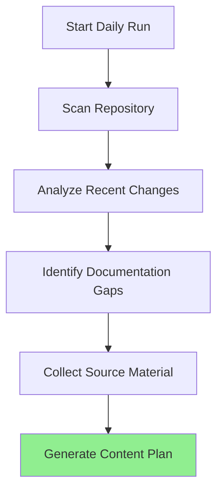
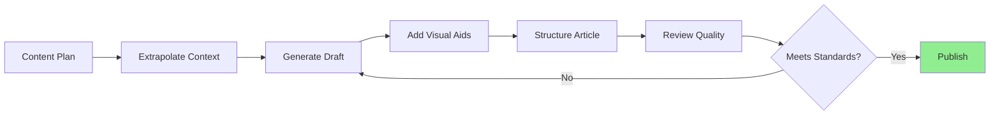
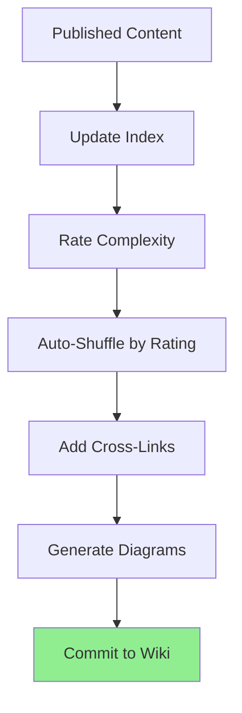
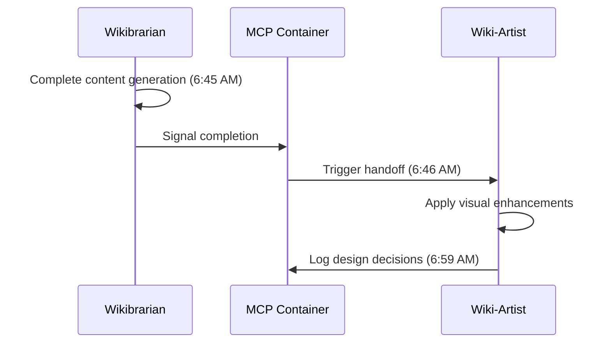

# 📚 Wikibrarian Agent

**Purpose**: Autonomous wiki content creation and maintenance agent  
**Schedule**: Daily at 6:00 AM UTC  
**Status**: ✅ Active  
**Version**: 1.0.0

---

## Overview

The Wikibrarian is an AI-powered content agent that acts as an investigative, content-driven journalist, maintaining a self-updating library of informational, educational, and guiding material across all repository wiki pages. It treats each wiki section as a professional blog, ensuring content is well-understood, enjoyable to read, educating, and actionably valuable.

### Core Mission

Transform repository documentation into an **expertly cuiding and informing blog** that:
- 📖 Bridges greater understanding of concepts and actions
- 🎓 Provides educational value for all skill levels
- 🔧 Offers actionable, step-by-step guidance
- 📊 Maintains visual coherence with diagrams, charts, and tables
- 🔄 Self-updates daily with latest repository insights

---

## Key Features

### 1. **Content Generation**
- ✅ Utilizes GPT-4.1/GPT-5.1 Mini for content extrapolation
- ✅ Article flow cadence and structure
- ✅ Context-aware content generation
- ✅ Purpose-driven instruction segments

### 2. **Wiki Structure**
- ✅ Indexed tabs with neat organization
- ✅ Categorized segments per tab
- ✅ Wrapped lines in index tables
- ✅ Auto-shuffled complexity ratings

### 3. **Visual Enhancement**
- ✅ Live links throughout content
- ✅ Mermaid diagrams and flowcharts
- ✅ Data visualization charts
- ✅ 50% lists converted to tables for visual coherence

### 4. **Content Categories**
- Development guides
- Automation best practices
- Business process documentation
- Security guidelines
- Guided step actions
- Educational material

### 5. **MCP Container Integration**
- ✅ Persistent memory across runs
- ✅ Quality and branding continuity
- ✅ Work history tracking
- ✅ Learning and improvement

---

## Wiki Architecture

### Tab Structure

Each wiki tab follows this standardized structure:

```
┌─────────────────────────────────────────────────────────┐
│ Tab Name: [Category Name]                              │
├─────────────────────────────────────────────────────────┤
│ Description: What this tab contains                     │
│ Purpose: Why this content exists                        │
│ Use Case: When to reference this content               │
├─────────────────────────────────────────────────────────┤
│                                                         │
│ INDEX (Complexity-Rated & Auto-Shuffled)               │
│ ┌───────┬─────────────┬────────────┬──────────┐       │
│ │ # │ Topic │ Complexity │ Category │          │       │
│ ├───────┼─────────────┼────────────┼──────────┤       │
│ │ 1 │ ... │ ⭐ Basic │ Dev │                 │       │
│ │ 2 │ ... │ ⭐⭐ Inter │ Auto │               │       │
│ │ 3 │ ... │ ⭐⭐⭐ Adv │ Sec │                │       │
│ └───────┴─────────────┴────────────┴──────────┘       │
│                                                         │
│ EXPANDED CONTENT                                        │
│ - Introduction                                          │
│ - Core Concepts                                         │
│ - Step-by-Step Guides                                   │
│ - Visual Aids (Diagrams/Charts)                         │
│ - Best Practices                                        │
│ - Common Pitfalls                                       │
│ - Advanced Topics                                       │
│ - Further Reading                                       │
│                                                         │
└─────────────────────────────────────────────────────────┘
```

---

## Planned Wiki Tabs

### 1. **Development Hub**
**Tab Name**: `Development-Guide`  
**Description**: Comprehensive development workflows, patterns, and practices  
**Purpose**: Enable developers to build efficiently and correctly  
**Use Case**: Reference when starting new features or troubleshooting

**Content Segments**:
- Getting Started (⭐ Basic)
- Development Workflow (⭐⭐ Intermediate)
- TypeScript Patterns (⭐⭐ Intermediate)
- Testing Strategies (⭐⭐ Intermediate)
- Advanced Architecture (⭐⭐⭐ Advanced)

### 2. **Automation Excellence**
**Tab Name**: `Automation-Best-Practices`  
**Description**: Automation patterns, agent design, and workflow optimization  
**Purpose**: Guide creation of robust, maintainable automations  
**Use Case**: Reference when building new agents or workflows

**Content Segments**:
- Automation Fundamentals (⭐ Basic)
- GitHub Actions Workflows (⭐⭐ Intermediate)
- Agent Design Patterns (⭐⭐ Intermediate)
- Scheduling & Triggers (⭐⭐ Intermediate)
- Error Handling & Retry (⭐⭐⭐ Advanced)
- Performance Optimization (⭐⭐⭐ Advanced)

### 3. **Business Operations**
**Tab Name**: `Business-Processes`  
**Description**: Business logic, workflows, and operational guidelines  
**Purpose**: Document business processes and decision frameworks  
**Use Case**: Reference for business logic implementation

**Content Segments**:
- Process Mapping (⭐ Basic)
- Workflow Design (⭐⭐ Intermediate)
- ROI Calculation (⭐⭐ Intermediate)
- Stakeholder Management (⭐⭐ Intermediate)

### 4. **Security Center**
**Tab Name**: `Security-Guidelines`  
**Description**: Security best practices, vulnerability management, and compliance  
**Purpose**: Ensure secure development and deployment  
**Use Case**: Reference before committing code or deploying

**Content Segments**:
- Security Basics (⭐ Basic)
- Authentication & Authorization (⭐⭐ Intermediate)
- Secrets Management (⭐⭐ Intermediate)
- Vulnerability Scanning (⭐⭐ Intermediate)
- Threat Modeling (⭐⭐⭐ Advanced)
- Compliance & Auditing (⭐⭐⭐ Advanced)

### 5. **Chrome Extension**
**Tab Name**: `Chrome-Extension-Guide`  
**Description**: Complete Chrome extension architecture and features  
**Purpose**: Document browser automation capabilities  
**Use Case**: Reference when using or extending Chrome extension

**Content Segments**:
- Extension Overview (⭐ Basic)
- Feature Catalog (⭐⭐ Intermediate)
- Architecture Deep Dive (⭐⭐⭐ Advanced)
- Playwright Integration (⭐⭐⭐ Advanced)

### 6. **Agent Registry**
**Tab Name**: `Agent-Catalog`  
**Description**: Complete agent documentation with usage examples  
**Purpose**: Provide searchable agent reference  
**Use Case**: Find and use existing agents

**Content Segments**:
- Agent Overview (⭐ Basic)
- By Category (⭐ Basic)
- Usage Examples (⭐⭐ Intermediate)
- Custom Agent Development (⭐⭐⭐ Advanced)

### 7. **Statistics & Metrics**
**Tab Name**: `Repository-Analytics`  
**Description**: Repository health metrics and growth analytics  
**Purpose**: Track repository progress and quality  
**Use Case**: Monitor repository health and trends

**Content Segments**:
- Key Metrics (⭐ Basic)
- Code Growth Analysis (⭐⭐ Intermediate)
- Quality Trends (⭐⭐ Intermediate)
- Performance Benchmarks (⭐⭐ Intermediate)

### 8. **Getting Started**
**Tab Name**: `Quick-Start`  
**Description**: Fast-track onboarding for new contributors  
**Purpose**: Enable rapid contribution  
**Use Case**: First stop for new contributors

**Content Segments**:
- 5-Minute Setup (⭐ Basic)
- Common Tasks (⭐ Basic)
- Contribution Guide (⭐⭐ Intermediate)

### 9. **Troubleshooting**
**Tab Name**: `Problem-Solving`  
**Description**: Common issues and solutions  
**Purpose**: Reduce time spent debugging  
**Use Case**: Reference when encountering errors

**Content Segments**:
- Common Errors (⭐ Basic)
- Debugging Techniques (⭐⭐ Intermediate)
- Performance Issues (⭐⭐⭐ Advanced)

### 10. **API Reference**
**Tab Name**: `API-Documentation`  
**Description**: Complete API endpoint and schema documentation  
**Purpose**: Enable API integration  
**Use Case**: Reference when building API clients

**Content Segments**:
- API Overview (⭐ Basic)
- Endpoint Reference (⭐⭐ Intermediate)
- Authentication (⭐⭐ Intermediate)
- Advanced Usage (⭐⭐⭐ Advanced)

---

## Content Generation Process

### Step 1: Context Gathering


### Step 2: Content Creation


### Step 3: Wiki Update


---

## Content Quality Standards

### Article Structure

Every article follows journalistic best practices:

1. **Headline** - Clear, descriptive title
2. **Lede** - Opening paragraph summarizing key points
3. **Nut Graf** - Why this matters, context setting
4. **Body** - Main content in logical flow
5. **Conclusion** - Summary and next steps
6. **Resources** - Further reading and links

### Writing Style

- **Clarity**: Plain language, avoid jargon
- **Conciseness**: Respect reader's time
- **Accuracy**: Fact-checked and verified
- **Actionability**: Clear next steps
- **Engagement**: Conversational yet professional

### Visual Elements

- **Diagrams**: 1-2 per article minimum
- **Charts**: For data-heavy sections
- **Tables**: 50% of lists converted
- **Code Blocks**: Syntax-highlighted examples
- **Screenshots**: When helpful for UI

---

## Complexity Rating System

### ⭐ Basic (Level 1)
- **Target**: Beginners, new contributors
- **Complexity**: Simple concepts, step-by-step
- **Prerequisites**: None
- **Time**: 5-15 minutes to understand

### ⭐⭐ Intermediate (Level 2)
- **Target**: Regular contributors, experienced developers
- **Complexity**: Moderate concepts, some assumptions
- **Prerequisites**: Basic knowledge
- **Time**: 15-30 minutes to understand

### ⭐⭐⭐ Advanced (Level 3)
- **Target**: Expert contributors, architects
- **Complexity**: Complex concepts, deep dives
- **Prerequisites**: Strong foundational knowledge
- **Time**: 30+ minutes to understand

---

## Auto-Shuffle Algorithm

Wiki index is automatically reordered daily based on:

1. **Complexity** (Primary Sort)
   - Basic (⭐) first
   - Intermediate (⭐⭐) middle
   - Advanced (⭐⭐⭐) last

2. **Relevance** (Secondary Sort)
   - Recent activity
   - User access patterns
   - Dependency order

3. **Category** (Tertiary Sort)
   - Dev, Auto, Business, Security, etc.

---

## MCP Container Configuration

### Container Name
`wikibrarian-mcp`

### Persistent Memory

```json
{
  "memory": {
    "content_history": [],
    "quality_scores": {},
    "improvement_suggestions": [],
    "branding_guidelines": {
      "tone": "professional yet approachable",
      "style": "journalistic",
      "voice": "helpful expert"
    },
    "work_log": []
  }
}
```

### Learning Capabilities

The Wikibrarian learns and improves through:

1. **Content Quality Tracking**
   - Monitors user engagement
   - Tracks content updates
   - Records successful patterns

2. **Batch Learning**
   - Processes GitHub documentation
   - Studies best practices
   - Updates templates

3. **Continuous Improvement**
   - Refines writing style
   - Enhances visual aids
   - Optimizes structure

---

## Daily Workflow

### 6:00 AM UTC Schedule

```
06:00 - Wake up (GitHub Actions trigger)
06:01 - Load MCP container memory
06:02 - Scan repository for changes
06:05 - Identify documentation needs
06:10 - Generate content plan
06:15 - Create/update wiki pages
06:45 - Generate diagrams and charts
06:50 - Update indices and cross-links
06:55 - Rate complexity and auto-shuffle
06:58 - Commit changes to wiki
07:00 - Complete (hands off to Code Timeline Agent)
```

---

## Integration Points

### Internal Resources

The Wikibrarian has full read access to:

- **Repository Files**: All source code and docs
- **Git History**: Commit messages and diffs
- **Issues & PRs**: Discussion context
- **GitHub Docs**: Official best practices
- **Wiki Best Practices**: Community standards

### External Resources (Optional)

With API keys (BYOK):

- **GPT-4.1/GPT-5.1 Mini**: Advanced content generation
- **Diagram APIs**: Auto-generated visuals
- **Analytics**: User engagement tracking

---

## Table vs List Decision Matrix

The Wikibrarian converts 50% of lists to tables based on:

| Scenario | Use Table | Use List |
|----------|-----------|----------|
| 3+ columns of data | ✅ Yes | ❌ No |
| Comparisons | ✅ Yes | ❌ No |
| Sequential steps | ❌ No | ✅ Yes |
| Simple enumeration | ❌ No | ✅ Yes |
| Complex relationships | ✅ Yes | ❌ No |
| Quick reference | ✅ Yes | ❌ No |

---

## Example Wiki Page Structure

### Development-Guide Wiki Tab

```markdown
# 🛠️ Development Guide

**Description**: Comprehensive development workflows, patterns, and practices for building quality features efficiently.

**Purpose**: Enable developers at all levels to contribute effectively to the repository.

**Use Case**: Reference when starting new features, troubleshooting issues, or learning best practices.

---

## 📋 Content Index

| # | Topic | Complexity | Category | Est. Time |
|---|-------|------------|----------|-----------|
| 1 | Getting Started | ⭐ Basic | Dev | 10 min |
| 2 | Development Workflow | ⭐⭐ Intermediate | Dev | 20 min |
| 3 | TypeScript Patterns | ⭐⭐ Intermediate | Dev | 25 min |
| 4 | Testing Strategies | ⭐⭐ Intermediate | Dev | 30 min |
| 5 | Advanced Architecture | ⭐⭐⭐ Advanced | Dev | 45 min |

---

## 1. Getting Started (⭐ Basic)

### Overview

Get up and running with the repository in under 10 minutes.

### Prerequisites

- Node.js 18+
- Git installed
- GitHub account

### Step-by-Step Guide

\`\`\`mermaid
graph LR
    A[Clone Repo] --> B[Install Dependencies]
    B --> C[Configure Environment]
    C --> D[Run Tests]
    D --> E[Start Development]
    
    style E fill:#90EE90
\`\`\`

#### Step 1: Clone the Repository

\`\`\`bash
git clone https://github.com/creditXcredit/workstation.git
cd workstation
\`\`\`

#### Step 2: Install Dependencies

\`\`\`bash
npm install
\`\`\`

[... continued with detailed steps, visuals, best practices ...]

---

## 2. Development Workflow (⭐⭐ Intermediate)

[... comprehensive article-style content ...]

---

## Visual Reference: Complete Development Flow

\`\`\`mermaid
graph TD
    A[Feature Request] --> B[Create Branch]
    B --> C[Implement Feature]
    C --> D[Write Tests]
    D --> E{Tests Pass?}
    E -->|No| C
    E -->|Yes| F[Commit Changes]
    F --> G[Open PR]
    G --> H[Code Review]
    H --> I{Approved?}
    I -->|No| C
    I -->|Yes| J[Merge to Main]
    J --> K[Deploy]
\`\`\`

---

## Best Practices Summary

| Practice | Why It Matters | Impact |
|----------|----------------|--------|
| Write tests first | Catches bugs early | High |
| Small commits | Easy to review | Medium |
| Clear commit messages | Maintains history | High |
| Code reviews | Knowledge sharing | High |

---

## Common Pitfalls

\`\`\`mermaid
pie title "Common Development Issues"
    "Missing Tests" : 30
    "Poor Error Handling" : 25
    "Unclear Documentation" : 20
    "Complex Logic" : 15
    "Other" : 10
\`\`\`

[... detailed explanations of each pitfall and solutions ...]

---

## Further Reading

- [API Documentation](API-Documentation)
- [Testing Strategies](Testing-Guide)
- [Code Review Guide](Code-Review)

---

**Last Updated**: 2025-11-20 06:00 UTC  
**Next Update**: 2025-11-21 06:00 UTC  
**Maintained by**: Wikibrarian Agent
```

---

## Configuration

### wikibrarian-config.json

```json
{
  "agent": {
    "name": "Wikibrarian",
    "version": "1.0.0",
    "schedule": "0 6 * * *",
    "timezone": "UTC"
  },
  "content": {
    "style": "journalistic",
    "tone": "professional-approachable",
    "target_audience": "all-levels",
    "article_length": {
      "basic": "500-1000 words",
      "intermediate": "1000-2000 words",
      "advanced": "2000-3000 words"
    }
  },
  "visuals": {
    "diagrams_per_article": 2,
    "tables_vs_lists_ratio": 0.5,
    "chart_types": ["mermaid", "pie", "bar", "flow"],
    "screenshot_when_helpful": true
  },
  "wiki_tabs": [
    "Development-Guide",
    "Automation-Best-Practices",
    "Business-Processes",
    "Security-Guidelines",
    "Chrome-Extension-Guide",
    "Agent-Catalog",
    "Repository-Analytics",
    "Quick-Start",
    "Problem-Solving",
    "API-Documentation"
  ],
  "complexity_rating": {
    "auto_shuffle": true,
    "primary_sort": "complexity",
    "secondary_sort": "relevance",
    "tertiary_sort": "category"
  },
  "mcp_container": {
    "name": "wikibrarian-mcp",
    "memory_persistence": true,
    "learning_enabled": true,
    "batch_learning": {
      "github_docs": true,
      "wiki_best_practices": true,
      "efficiency_optimization": true
    }
  },
  "ai_model": {
    "primary": "gpt-4.1-turbo",
    "fallback": "gpt-5.1-mini",
    "context_window": 128000,
    "temperature": 0.7
  }
}
```

---

## 🤝 Agentic Handoff to Wiki-Artist

Upon completing content creation, the Wikibrarian automatically hands off to the **Wiki-Artist Agent** for visual enhancement.

### Handoff Protocol



### Handoff Signal

When Wikibrarian completes work, it signals to Wiki-Artist via MCP:

```json
{
  "event": "content_complete",
  "timestamp": "2025-11-21T06:45:00Z",
  "source_agent": "wikibrarian",
  "target_agent": "wiki-artist",
  "pages_updated": ["wiki/Quick-Start.md", "wiki/Development-Guide.md"],
  "preserve_content": true,
  "enhancement_priority": ["diagrams", "badges", "callouts"]
}
```

### Division of Responsibilities

| Agent | Responsibility | Focus |
|-------|----------------|-------|
| **Wikibrarian** | Content creation | Text, explanations, guides, educational material |
| **Wiki-Artist** | Visual enhancement | Diagrams, badges, styling, layout |

**Note**: Wiki-Artist never modifies content, only enhances visual presentation.

---

## Usage

### Manual Trigger

```bash
# Trigger via GitHub Actions
gh workflow run wikibrarian-agent.yml

# With dry-run
gh workflow run wikibrarian-agent.yml -f dry_run=true
```

### View Generated Content

```bash
# View wiki locally
gh repo clone creditXcredit/workstation.wiki.git
cd workstation.wiki
```

---

## Monitoring

### Health Metrics

The Wikibrarian tracks:

- **Content Quality Score**: 0-100 based on completeness
- **User Engagement**: Page views and time spent
- **Update Frequency**: Pages updated per day
- **Coverage**: % of repository topics documented

### Logs

Stored in `logs/wikibrarian/`:
- `YYYY-MM-DD.log` - Daily execution logs
- `content-quality.json` - Quality metrics
- `improvement-suggestions.json` - Auto-generated improvements

---

## Troubleshooting

### Common Issues

**Issue: Content generation slow**
```bash
# Check AI model response times
cat logs/wikibrarian/$(date +%Y-%m-%d).log | grep "generation_time"
```

**Issue: Diagrams not rendering**
```bash
# Validate Mermaid syntax
npx -p @mermaid-js/mermaid-cli mmdc --validate wiki/*.md
```

**Issue: Wiki not updating**
```bash
# Check GitHub Actions logs
gh run list --workflow=wikibrarian-agent.yml --limit=5
```

---

## Future Enhancements

- [ ] Multi-language support
- [ ] Interactive tutorials
- [ ] Video content generation
- [ ] Community contribution integration
- [ ] AI-powered Q&A chatbot
- [ ] Personalized learning paths

---

**Version**: 1.0.0  
**Status**: ✅ Production Ready  
**Schedule**: Daily at 6:00 AM UTC  
**First Run**: 2025-11-21 06:00 UTC

---

*The Wikibrarian - Your autonomous documentation expert, maintaining a living library of knowledge.*
