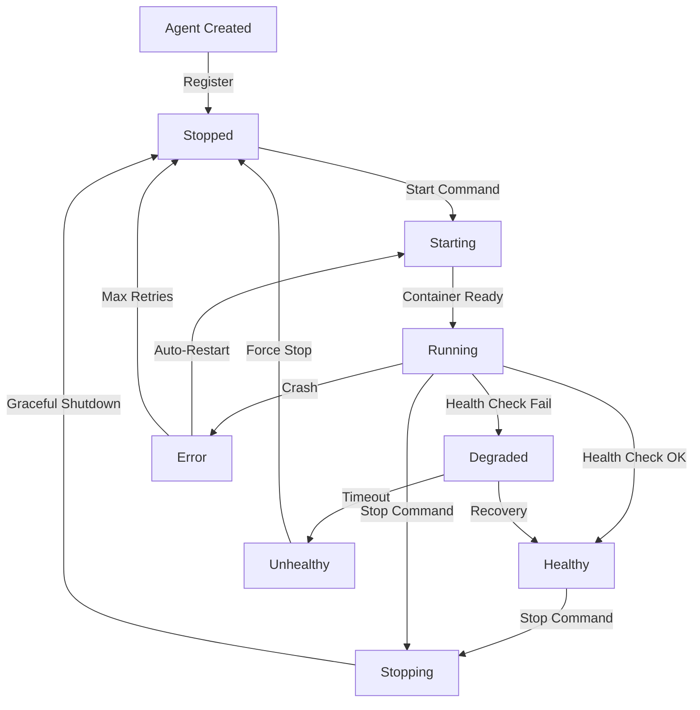
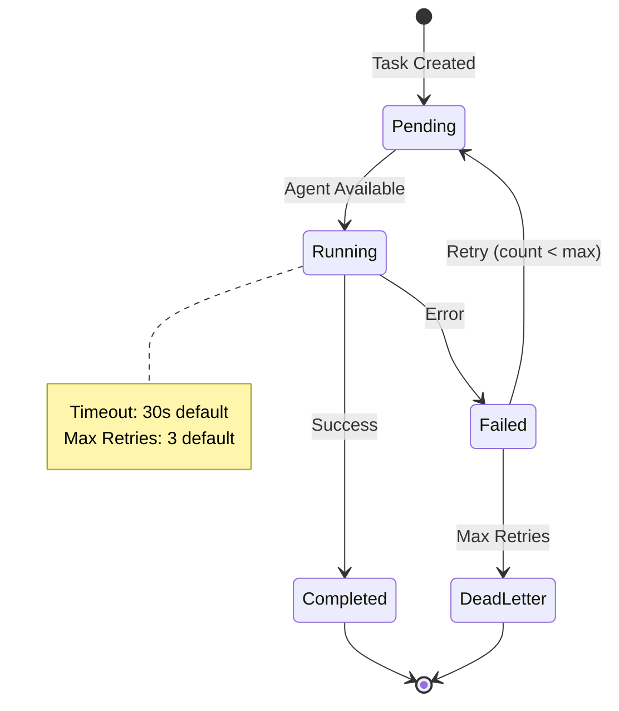

# Agent Orchestration System

**Version**: 1.0  
**Last Updated**: November 24, 2024  
**Status**: ✅ Production Ready

---

## Overview

The Workstation Agent Orchestration System is a database-backed task management and coordination platform that manages 21+ agents and 20+ MCP containers. It provides:

- ✅ **Persistent Task Queue** - PostgreSQL-backed task persistence
- ✅ **Agent Registry** - Centralized agent metadata and health tracking  
- ✅ **Lifecycle Management** - Start/stop/restart agent containers
- ✅ **Health Monitoring** - Real-time agent health status
- ✅ **Task Distribution** - Intelligent task routing to agents
- ✅ **Statistics Tracking** - Performance metrics and analytics

---

## Architecture

### System Components

**High-Level Architecture**

```
┌─────────────────────────────────────────────────────────────────┐
│                        Client Applications                       │
│              (Web UI, CLI, External Services)                    │
└───────────────────┬─────────────────────────────────────────────┘
                    │ HTTP/REST + JWT Auth
                    ▼
┌─────────────────────────────────────────────────────────────────┐
│                   Express API Server (Port 3000)                 │
│                        (src/index.ts)                            │
│  ┌─────────────┐  ┌─────────────┐  ┌──────────────┐           │
│  │  Auth       │  │  Rate       │  │  CORS        │           │
│  │  Middleware │  │  Limiting   │  │  Protection  │           │
│  └─────────────┘  └─────────────┘  └──────────────┘           │
└───────────────────┬─────────────────────────────────────────────┘
                    │
                    ▼
┌─────────────────────────────────────────────────────────────────┐
│                    Agent Routes Layer                            │
│                  (src/routes/agents.ts)                          │
│  ┌──────────┐ ┌──────────┐ ┌──────────┐ ┌──────────┐          │
│  │ /agents  │ │ /tasks   │ │ /health  │ │ /stats   │          │
│  └──────────┘ └──────────┘ └──────────┘ └──────────┘          │
└───────────────────┬─────────────────────────────────────────────┘
                    │
                    ▼
┌─────────────────────────────────────────────────────────────────┐
│              Agent Orchestrator Service                          │
│          (src/services/agent-orchestrator.ts)                    │
│                                                                   │
│  Core Functions:                                                 │
│  • getAllAgents()          • createTask(agentId, type, payload) │
│  • getTaskStatus(taskId)   • startAgent(agentId)                │
│  • stopAgent(agentId)      • updateAgentHealth(agentId, status)│
│  • getAgentStatistics(agentId)                                  │
│  • Task Queue Processing   • Retry Logic                        │
│  • Priority Management     • Timeout Handling                   │
└───────────────────┬─────────────────────────────────────────────┘
                    │
        ┌───────────┴───────────┬──────────────┐
        ▼                       ▼              ▼
┌───────────────┐      ┌────────────────┐  ┌─────────────────┐
│  PostgreSQL   │      │  Message       │  │  Agent          │
│  Database     │      │  Broker        │  │  Containers     │
│               │      │  (Event Bus)   │  │  (Docker)       │
│ • agent_      │      │                │  │                 │
│   registry    │      │ • pub/sub      │  │ • agent1-21     │
│ • agent_tasks │      │ • events       │  │ • MCP (20)      │
│ • task queue  │      │ • handoffs     │  │ • specialized   │
└───────────────┘      └────────────────┘  └─────────────────┘
```

**Data Flow Diagram**

```
Client Request Flow:
───────────────────

1. Client → API Server
   POST /api/agents/tasks
   Authorization: Bearer <JWT>
   Body: { agentId, type, payload, priority }
   
2. API Server → Orchestrator
   validateRequest()
   authenticateToken()
   createTask()
   
3. Orchestrator → Database
   INSERT INTO agent_tasks
   (agent_id, type, payload, priority, status='pending')
   
4. Orchestrator → Task Queue
   enqueueTask(taskId)
   prioritize()
   
5. Task Queue → Agent
   selectAvailableAgent()
   assignTask(agentId, taskId)
   
6. Agent → Execute
   processTask(payload)
   reportProgress()
   
7. Agent → Database
   UPDATE agent_tasks
   SET status='completed', result={...}
   
8. Database → Client (poll)
   GET /api/agents/tasks/{taskId}
   Return: { status, result }

Event-Driven Flow:
──────────────────

Agent A → Message Broker
  publishEvent('task.completed', { taskId, result })
  
Message Broker → [Agent B, Agent C, Agent D]
  subscribers.forEach(agent => agent.handleEvent(event))
  
Agent B → Orchestrator
  createTask(nextStepAgentId, 'process', result)
```

**Agent Lifecycle**



**Task State Machine**



### System Components

```
┌─────────────────────────────────────────────────────────┐
│                   Express API Server                     │
│                   (src/index.ts)                         │
└────────────────────┬────────────────────────────────────┘
                     │
                     ▼
┌─────────────────────────────────────────────────────────┐
│              Agent Routes (/api/agents)                  │
│              (src/routes/agents.ts)                      │
└────────────────────┬────────────────────────────────────┘
                     │
                     ▼
┌─────────────────────────────────────────────────────────┐
│           Agent Orchestrator Service                     │
│        (src/services/agent-orchestrator.ts)              │
│                                                           │
│  • getAllAgents()                                        │
│  • createTask(agentId, type, payload)                   │
│  • getTaskStatus(taskId)                                │
│  • startAgent(agentId) / stopAgent(agentId)             │
│  • updateAgentHealth(agentId, status)                   │
│  • getAgentStatistics(agentId)                          │
└────────────────────┬────────────────────────────────────┘
                     │
                     ▼
┌─────────────────────────────────────────────────────────┐
│              PostgreSQL Database                         │
│                                                           │
│  Tables:                                                 │
│  • agent_registry - Agent metadata                      │
│  • agent_tasks - Task queue and history                 │
└─────────────────────────────────────────────────────────┘
```

### Database Schema

#### agent_registry Table

Stores metadata for all registered agents and MCP containers.

```sql
CREATE TABLE agent_registry (
    id SERIAL PRIMARY KEY,
    name VARCHAR(255) NOT NULL,
    type VARCHAR(100) NOT NULL,
    container_name VARCHAR(255),
    status VARCHAR(50) DEFAULT 'stopped',
    health_status VARCHAR(50) DEFAULT 'unknown',
    capabilities TEXT[],
    metadata JSONB,
    last_health_check TIMESTAMP,
    created_at TIMESTAMP DEFAULT CURRENT_TIMESTAMP
);
```

**Fields**:
- `id` - Unique agent identifier
- `name` - Human-readable agent name
- `type` - Agent type (e.g., 'browser', 'code', 'mcp')
- `container_name` - Docker container name (if containerized)
- `status` - Current status ('running', 'stopped', 'error')
- `health_status` - Health check result ('healthy', 'unhealthy', 'degraded')
- `capabilities` - Array of agent capabilities
- `metadata` - Additional agent-specific data
- `last_health_check` - Timestamp of last health check
- `created_at` - Agent registration timestamp

#### agent_tasks Table

Stores task queue and execution history.

```sql
CREATE TABLE agent_tasks (
    id SERIAL PRIMARY KEY,
    agent_id INTEGER REFERENCES agent_registry(id),
    type VARCHAR(100) NOT NULL,
    payload JSONB NOT NULL,
    priority INTEGER DEFAULT 5,
    status VARCHAR(50) DEFAULT 'pending',
    created_by VARCHAR(255),
    result JSONB,
    retry_count INTEGER DEFAULT 0,
    max_retries INTEGER DEFAULT 3,
    created_at TIMESTAMP DEFAULT CURRENT_TIMESTAMP,
    started_at TIMESTAMP,
    completed_at TIMESTAMP
);
```

**Fields**:
- `id` - Unique task identifier
- `agent_id` - Target agent for task execution
- `type` - Task type (e.g., 'scrape', 'analyze', 'deploy')
- `payload` - Task input data
- `priority` - Task priority (1-10, higher = more important)
- `status` - Task status ('pending', 'running', 'completed', 'failed')
- `created_by` - User ID that created the task
- `result` - Task output data
- `retry_count` - Number of retry attempts
- `max_retries` - Maximum allowed retries

---

## API Endpoints

All endpoints require JWT authentication via `Authorization: Bearer <token>` header.

### Agent Management

#### GET /api/agents
Get all registered agents.

**Response**:
```json
{
  "success": true,
  "data": {
    "agents": [
      {
        "id": "1",
        "name": "browser-automation-agent",
        "type": "browser",
        "containerName": "agent-browser-1",
        "status": "running",
        "healthStatus": "healthy",
        "capabilities": ["navigate", "click", "scrape"],
        "lastHealthCheck": "2024-11-24T18:00:00Z"
      }
    ],
    "total": 21
  }
}
```

#### GET /api/agents/:id
Get specific agent details with statistics.

**Response**:
```json
{
  "success": true,
  "data": {
    "agent": {
      "id": "1",
      "name": "browser-automation-agent",
      "status": "running"
    },
    "stats": {
      "total_tasks": "150",
      "completed_tasks": "142",
      "failed_tasks": "5",
      "active_tasks": "3",
      "avg_execution_time_ms": 2500
    }
  }
}
```

#### POST /api/agents/:id/start
Start an agent container.

**Response**:
```json
{
  "success": true,
  "message": "Agent 1 started successfully"
}
```

#### POST /api/agents/:id/stop
Stop an agent container.

**Response**:
```json
{
  "success": true,
  "message": "Agent 1 stopped successfully"
}
```

#### POST /api/agents/:id/health
Update agent health status.

**Request Body**:
```json
{
  "healthStatus": "healthy",
  "metadata": {
    "cpu": "25%",
    "memory": "512MB",
    "uptime": 3600
  }
}
```

### Task Management

#### POST /api/agents/tasks
Create a new agent task.

**Request Body**:
```json
{
  "agentId": "1",
  "type": "scrape",
  "payload": {
    "url": "https://example.com",
    "selectors": ["h1", ".content"]
  },
  "priority": 8
}
```

**Response**:
```json
{
  "success": true,
  "taskId": "42",
  "message": "Task created successfully"
}
```

#### GET /api/agents/tasks/:id
Get task status and result.

**Response**:
```json
{
  "success": true,
  "data": {
    "id": "42",
    "agent_id": "1",
    "agent_name": "browser-automation-agent",
    "type": "scrape",
    "status": "completed",
    "result": {
      "success": true,
      "data": {
        "title": "Example Domain",
        "content": "..."
      }
    },
    "created_at": "2024-11-24T17:00:00Z",
    "completed_at": "2024-11-24T17:00:03Z"
  }
}
```

#### GET /api/agents/:id/tasks
Get all tasks for a specific agent.

**Query Parameters**:
- `limit` (optional, default: 50) - Maximum number of tasks to return

**Response**:
```json
{
  "success": true,
  "data": {
    "tasks": [...],
    "total": 150
  }
}
```

### Statistics

#### GET /api/agents/:id/statistics
Get agent performance statistics.

**Response**:
```json
{
  "success": true,
  "data": {
    "total_tasks": "150",
    "completed_tasks": "142",
    "failed_tasks": "5",
    "active_tasks": "3",
    "avg_execution_time_ms": 2500
  }
}
```

#### GET /api/agents/system/overview
Get system-wide overview of all agents.

**Response**:
```json
{
  "success": true,
  "data": {
    "totalAgents": 21,
    "runningAgents": 18,
    "stoppedAgents": 3,
    "healthyAgents": 17,
    "degradedAgents": 1,
    "unhealthyAgents": 0,
    "pendingTasks": 12,
    "mcpContainers": 20,
    "agentsByType": {
      "browser": 5,
      "code": 3,
      "mcp": 20
    }
  }
}
```

---

## Integration Examples

### Registering a New Agent

Agents are registered during system initialization via database seeding. To add a new agent:

1. Add entry to `agent_registry` table:
```sql
INSERT INTO agent_registry 
  (name, type, container_name, status, capabilities)
VALUES 
  ('my-custom-agent', 'custom', 'agent-custom-1', 'stopped', 
   ARRAY['capability1', 'capability2']);
```

2. Start the agent:
```bash
curl -X POST http://localhost:3000/api/agents/22/start \
  -H "Authorization: Bearer YOUR_JWT_TOKEN"
```

### Creating and Monitoring Tasks

**Example 1: Web Scraping Task**
```typescript
// Create a web scraping task
const response = await fetch('http://localhost:3000/api/agents/tasks', {
  method: 'POST',
  headers: {
    'Authorization': 'Bearer YOUR_JWT_TOKEN',
    'Content-Type': 'application/json'
  },
  body: JSON.stringify({
    agentId: '1',  // Browser automation agent
    type: 'scrape',
    payload: {
      url: 'https://example.com/products',
      selectors: {
        title: 'h1.product-title',
        price: 'span.price',
        description: 'div.description'
      }
    },
    priority: 7
  })
});

const { taskId } = await response.json();
console.log(`Created task: ${taskId}`);

// Poll for completion
const checkStatus = async () => {
  const statusRes = await fetch(
    `http://localhost:3000/api/agents/tasks/${taskId}`,
    {
      headers: { 'Authorization': 'Bearer YOUR_JWT_TOKEN' }
    }
  );
  const { data } = await statusRes.json();
  
  if (data.status === 'completed') {
    console.log('Scraped data:', data.result);
    // data.result = { title: "Product Name", price: "$99.99", ... }
  } else if (data.status === 'failed') {
    console.error('Task failed:', data.result);
  } else {
    setTimeout(checkStatus, 1000); // Check again in 1 second
  }
};

checkStatus();
```

**Example 2: Batch Task Creation**
```typescript
// Create multiple tasks in parallel
const urls = [
  'https://example.com/page1',
  'https://example.com/page2',
  'https://example.com/page3'
];

const taskPromises = urls.map(url =>
  fetch('http://localhost:3000/api/agents/tasks', {
    method: 'POST',
    headers: {
      'Authorization': 'Bearer YOUR_JWT_TOKEN',
      'Content-Type': 'application/json'
    },
    body: JSON.stringify({
      agentId: '1',
      type: 'scrape',
      payload: { url },
      priority: 5
    })
  }).then(res => res.json())
);

const tasks = await Promise.all(taskPromises);
console.log(`Created ${tasks.length} tasks`);

// Monitor all tasks
const results = await Promise.all(
  tasks.map(({ taskId }) =>
    waitForTaskCompletion(taskId, 'YOUR_JWT_TOKEN')
  )
);

console.log('All tasks completed:', results);

// Helper function
async function waitForTaskCompletion(taskId, token) {
  while (true) {
    const res = await fetch(
      `http://localhost:3000/api/agents/tasks/${taskId}`,
      { headers: { 'Authorization': `Bearer ${token}` } }
    );
    const { data } = await res.json();
    
    if (data.status === 'completed') return data.result;
    if (data.status === 'failed') throw new Error(data.result.error);
    
    await new Promise(resolve => setTimeout(resolve, 1000));
  }
}
```

**Example 3: Task with Timeout and Retry**
```typescript
async function createTaskWithRetry(agentId, type, payload, maxRetries = 3) {
  for (let attempt = 1; attempt <= maxRetries; attempt++) {
    try {
      const response = await fetch('http://localhost:3000/api/agents/tasks', {
        method: 'POST',
        headers: {
          'Authorization': 'Bearer YOUR_JWT_TOKEN',
          'Content-Type': 'application/json'
        },
        body: JSON.stringify({
          agentId,
          type,
          payload: {
            ...payload,
            timeout: 30000  // 30 second timeout
          },
          priority: 8,
          max_retries: maxRetries
        })
      });
      
      const { taskId } = await response.json();
      
      // Wait for completion with timeout
      const result = await Promise.race([
        waitForTaskCompletion(taskId, 'YOUR_JWT_TOKEN'),
        new Promise((_, reject) =>
          setTimeout(() => reject(new Error('Timeout')), 60000)
        )
      ]);
      
      return result;
    } catch (error) {
      if (attempt === maxRetries) throw error;
      console.log(`Attempt ${attempt} failed, retrying...`);
      await new Promise(resolve => setTimeout(resolve, 2000 * attempt));
    }
  }
}

// Usage
try {
  const result = await createTaskWithRetry('1', 'complex-task', {
    url: 'https://example.com',
    depth: 3
  });
  console.log('Success:', result);
} catch (error) {
  console.error('All retries failed:', error);
}
```

### Agent Health Monitoring

**Example 1: Basic Health Reporting**
```typescript
// Agents should report health status periodically
setInterval(async () => {
  const healthData = {
    healthStatus: 'healthy',
    metadata: {
      cpu: getCpuUsage(),
      memory: getMemoryUsage(),
      uptime: getUptime(),
      tasksProcessed: getTaskCount()
    }
  };
  
  await fetch(`http://localhost:3000/api/agents/${agentId}/health`, {
    method: 'POST',
    headers: {
      'Authorization': 'Bearer YOUR_JWT_TOKEN',
      'Content-Type': 'application/json'
    },
    body: JSON.stringify(healthData)
  });
}, 60000); // Every minute
```

**Example 2: Health Check with Error Handling**
```typescript
class AgentHealthReporter {
  constructor(agentId, token, intervalMs = 60000) {
    this.agentId = agentId;
    this.token = token;
    this.intervalMs = intervalMs;
    this.failureCount = 0;
  }
  
  async reportHealth() {
    try {
      const metrics = this.gatherMetrics();
      
      const response = await fetch(
        `http://localhost:3000/api/agents/${this.agentId}/health`,
        {
          method: 'POST',
          headers: {
            'Authorization': `Bearer ${this.token}`,
            'Content-Type': 'application/json'
          },
          body: JSON.stringify({
            healthStatus: this.determineHealthStatus(metrics),
            metadata: metrics
          })
        }
      );
      
      if (response.ok) {
        this.failureCount = 0;
      } else {
        throw new Error(`Health report failed: ${response.status}`);
      }
    } catch (error) {
      this.failureCount++;
      console.error('Health report error:', error);
      
      if (this.failureCount > 3) {
        // Alert: agent may be in bad state
        this.alertUnhealthy();
      }
    }
  }
  
  gatherMetrics() {
    return {
      cpu: process.cpuUsage(),
      memory: process.memoryUsage(),
      uptime: process.uptime(),
      tasksProcessed: this.taskCount,
      queueDepth: this.pendingTasks,
      lastTaskTime: this.lastTaskTimestamp,
      errors24h: this.errorCount
    };
  }
  
  determineHealthStatus(metrics) {
    if (metrics.cpu.user > 90 || metrics.memory.heapUsed > metrics.memory.heapTotal * 0.9) {
      return 'degraded';
    }
    if (this.failureCount > 0) {
      return 'degraded';
    }
    return 'healthy';
  }
  
  start() {
    this.interval = setInterval(() => this.reportHealth(), this.intervalMs);
    this.reportHealth(); // Report immediately on start
  }
  
  stop() {
    if (this.interval) clearInterval(this.interval);
  }
}

// Usage
const healthReporter = new AgentHealthReporter('1', 'YOUR_JWT_TOKEN');
healthReporter.start();
```

**Example 3: System-Wide Health Dashboard**
```typescript
// Fetch health status for all agents
async function getSystemHealth() {
  const response = await fetch(
    'http://localhost:3000/api/agents/system/overview',
    {
      headers: { 'Authorization': 'Bearer YOUR_JWT_TOKEN' }
    }
  );
  
  const { data } = await response.json();
  
  console.log('System Overview:');
  console.log(`- Total Agents: ${data.totalAgents}`);
  console.log(`- Healthy: ${data.healthyAgents} (${Math.round(data.healthyAgents/data.totalAgents*100)}%)`);
  console.log(`- Degraded: ${data.degradedAgents}`);
  console.log(`- Unhealthy: ${data.unhealthyAgents}`);
  console.log(`- Pending Tasks: ${data.pendingTasks}`);
  
  return data;
}

// Monitor and alert
setInterval(async () => {
  const health = await getSystemHealth();
  
  if (health.unhealthyAgents > 0) {
    // Alert: unhealthy agents detected
    sendAlert('CRITICAL', `${health.unhealthyAgents} agents unhealthy`);
  }
  
  if (health.pendingTasks > 100) {
    // Warning: high task backlog
    sendAlert('WARNING', `Task queue depth: ${health.pendingTasks}`);
  }
}, 300000); // Check every 5 minutes
```

---

## Task Processing Flow

1. **Task Creation**
   - Client calls `POST /api/agents/tasks`
   - Orchestrator validates agent exists
   - Task saved to database with status 'pending'
   - Task ID returned to client

2. **Task Execution**
   - Orchestrator processes task asynchronously
   - Task status updated to 'running'
   - Agent executes task logic
   - Result stored in database

3. **Task Completion**
   - Status updated to 'completed' or 'failed'
   - Result JSON stored in `result` field
   - Completion timestamp recorded

4. **Retry Logic**
   - On failure, `retry_count` incremented
   - If `retry_count < max_retries`, task re-queued
   - Otherwise, task marked as permanently failed

---

## Best Practices

### Task Design

1. **Idempotent Tasks**: Design tasks to be safely retried
2. **Small Payloads**: Keep task payloads under 1MB
3. **Clear Types**: Use descriptive task type names
4. **Priority Levels**: Reserve high priorities (8-10) for urgent tasks

### Health Checks

1. **Regular Updates**: Report health every 1-5 minutes
2. **Meaningful Metadata**: Include actionable metrics
3. **Degradation Detection**: Report 'degraded' before 'unhealthy'
4. **Auto-Recovery**: Implement self-healing where possible

### Monitoring

1. **Track Metrics**: Monitor task completion rates
2. **Alert on Failures**: Set up alerts for high failure rates
3. **Capacity Planning**: Monitor pending task queue depth
4. **Performance Trends**: Track average execution times

---

## Troubleshooting

### Agent Not Showing in Registry

**Problem**: Agent not visible in `GET /api/agents`

**Solutions**:
1. Check database connection
2. Verify agent entry exists in `agent_registry` table
3. Run `SELECT * FROM agent_registry WHERE name = 'agent-name'`

### Tasks Stuck in Pending

**Problem**: Tasks remain in 'pending' status indefinitely

**Solutions**:
1. Check agent status - must be 'running'
2. Verify orchestrator is processing tasks
3. Check database logs for errors
4. Restart orchestrator service

### High Task Failure Rate

**Problem**: Many tasks failing

**Solutions**:
1. Check agent logs for errors
2. Verify agent health status
3. Review task payloads for issues
4. Check retry count - may indicate systemic problem

---

## Performance Considerations

- **Max Concurrent Tasks**: Configurable via `MAX_CONCURRENT_TASKS` (default: 10)
- **Database Connection Pool**: Tuned for high throughput
- **Task Timeout**: Implement timeouts in agent logic
- **Queue Depth**: Monitor pending task count for bottlenecks

---

## Security

- **JWT Authentication**: Required for all endpoints
- **Task Isolation**: Tasks cannot access other task data
- **Input Validation**: All task payloads validated
- **SQL Injection Protection**: Parameterized queries used throughout

---

## Future Enhancements

- [ ] WebSocket support for real-time task updates
- [ ] Task dependencies and workflows
- [ ] Scheduled/recurring tasks
- [ ] Task result caching
- [ ] Multi-region agent deployment
- [ ] Auto-scaling based on queue depth

---

## Related Documentation

- [API Reference](../API.md) - Complete API documentation
- [Architecture Overview](../ARCHITECTURE.md) - System architecture
- [Agent Integration Guide](./AGENT_INTEGRATION.md) - Agent communication patterns
- [Subsystem Integration](./SUBSYSTEM_INTEGRATION.md) - MCP and message broker

---

## Support

For questions or issues with the orchestration system:
- **GitHub Issues**: https://github.com/creditXcredit/workstation/issues
- **Documentation**: See `/docs` directory
- **Source Code**: `src/services/agent-orchestrator.ts`
