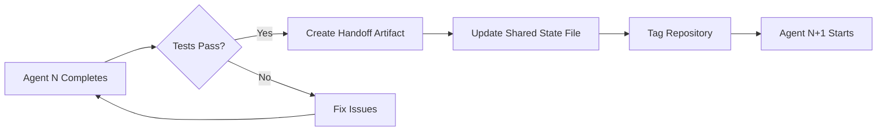

# Product Roadmap - stackBrowserAgent Evolution

**Vision**: Transform stackBrowserAgent from a lightweight JWT authentication service into the premier local-first AI automation platform with browser orchestration, multi-agent workflows, and natural language control.

**Mission**: Deliver privacy-first, cost-free automation that speaks human.

---

## Table of Contents

- [Current State](#current-state-phase-0---existing-infrastructure)
- [Phase 1: Core Browser Automation Layer](#phase-1-core-browser-automation-layer-weeks-1-2)
- [Phase 2: Agent Ecosystem](#phase-2-agent-ecosystem-weeks-3-4)
- [Phase 3: Slack Orchestration & Integration](#phase-3-slack-orchestration--integration-week-5)
- [Phase 4: Advanced Features & Polish](#phase-4-advanced-features--polish-week-6)
- [Phase 5: Enterprise & Scale](#phase-5-enterprise--scale-weeks-7-12)
- [Technology Evolution](#technology-evolution)
- [Competitive Differentiation](#competitive-differentiation)
- [Success Metrics](#success-metrics)

---

## Current State: Phase 0 - Existing Infrastructure

### ✅ What We Have Today

**Core Platform** (v1.x - Active)
- 🔐 JWT Authentication (HS256/HS384/HS512)
- ⚡ Express.js REST API server
- 🐳 Docker containerization with multi-platform support (amd64, arm64)
- 🚀 Railway one-click deployment
- 📝 TypeScript for type safety
- 🛡️ Enterprise security features:
  - Rate limiting (100 req/15min general, 10 req/15min auth)
  - Security headers (Helmet: CSP, HSTS, XSS protection)
  - CORS protection with configurable origins
  - IP anonymization for GDPR compliance
  - TruffleHog secret scanning
- ✅ 94% test coverage with Jest
- 🔍 Input validation with Joi
- 📊 Winston structured logging
- 🤖 CI/CD with GitHub Actions
- 📚 Comprehensive documentation (API, Architecture, Security, Deployment)

**Infrastructure**
```
src/
├── auth/
│   └── jwt.ts          # JWT token generation/verification
└── index.ts            # Main Express application

Available Endpoints:
GET  /health            # Health check with system metrics
GET  /auth/demo-token   # Demo token generation
POST /auth/token        # Custom token generation
GET  /api/protected     # Protected route example
GET  /api/agent/status  # Agent status (protected)
```

**Deployment Options**
- Railway (one-click deploy)
- Docker (GHCR published images with semantic versioning)
- Local development (npm scripts)
- CI/CD automated workflows

### 🎯 What's Missing for Browser Automation

1. **No browser control** - Repository name implies browser automation, but only LLM runtime exists
2. **No workflow orchestration** - No task scheduling, dependency management, or parallel execution
3. **No agent system** - No modular agent architecture for different capabilities
4. **No Slack integration** - No conversational interface or team collaboration features
5. **No data pipelines** - No CSV/Excel/PDF processing or data enrichment
6. **No persistent workflows** - No database for workflow definitions and execution history

**The Gap**: We're a JWT auth service when we should be a browser automation orchestration platform.

---

## Phase 1: Core Browser Automation Layer (Weeks 1-2)

### Objective
Add native browser control capabilities to fulfill the repository's name promise.

### 🏗️ New Directory Structure

```
src/
├── [Existing auth/ and index.ts]
│
├── automation/                      # 🆕 NEW AUTOMATION ROOT
│   ├── agents/
│   │   └── core/
│   │       ├── browser.ts          # Browser automation agent
│   │       ├── vision.ts           # Vision model integration
│   │       └── registry.ts         # Agent capability registry
│   │
│   ├── orchestrator/
│   │   ├── engine.ts               # Main orchestration logic
│   │   ├── scheduler.ts            # Task scheduling
│   │   └── state.ts                # Execution state machine
│   │
│   ├── workflow/
│   │   ├── parser.ts               # YAML/JSON workflow parser
│   │   └── validator.ts            # Workflow validation
│   │
│   └── db/
│       ├── schema.sql              # Database schema
│       └── models.ts               # ORM models
```

### 📦 New Dependencies

```json
{
  "dependencies": {
    "playwright-core": "^1.40.0",       // Browser automation
    "chromedp": "alternative option",    // Or Chrome DevTools Protocol
    "@playwright/test": "^1.40.0"       // Testing support
  }
}
```

### 🗄️ Database Schema (SQLite → Postgres)

```sql
-- Workflow definitions
CREATE TABLE workflows (
    id              UUID PRIMARY KEY DEFAULT gen_random_uuid(),
    name            VARCHAR(255) NOT NULL,
    description     TEXT,
    definition      JSONB NOT NULL,
    owner_id        UUID NOT NULL,
    workspace_id    UUID,
    status          VARCHAR(20) DEFAULT 'active',
    version         INTEGER DEFAULT 1,
    
    -- Execution settings
    timeout_seconds INTEGER DEFAULT 3600,
    max_retries     INTEGER DEFAULT 3,
    
    -- Scheduling
    cron_schedule   VARCHAR(100),
    next_run_at     TIMESTAMP,
    
    created_at      TIMESTAMP DEFAULT NOW(),
    updated_at      TIMESTAMP DEFAULT NOW()
);

-- Execution tracking
CREATE TABLE executions (
    id              UUID PRIMARY KEY DEFAULT gen_random_uuid(),
    workflow_id     UUID NOT NULL REFERENCES workflows(id),
    status          VARCHAR(20) NOT NULL,      -- pending, running, completed, failed
    trigger_type    VARCHAR(50),               -- manual, scheduled, webhook, slack
    triggered_by    UUID,
    
    started_at      TIMESTAMP,
    completed_at    TIMESTAMP,
    duration_ms     INTEGER,
    
    output          JSONB,
    error_message   TEXT,
    
    created_at      TIMESTAMP DEFAULT NOW()
);

-- Task execution (individual steps)
CREATE TABLE tasks (
    id              UUID PRIMARY KEY DEFAULT gen_random_uuid(),
    execution_id    UUID NOT NULL REFERENCES executions(id),
    name            VARCHAR(255) NOT NULL,
    agent_type      VARCHAR(100) NOT NULL,
    action          VARCHAR(100) NOT NULL,
    parameters      JSONB NOT NULL,
    
    status          VARCHAR(20) NOT NULL,
    retry_count     INTEGER DEFAULT 0,
    
    queued_at       TIMESTAMP DEFAULT NOW(),
    started_at      TIMESTAMP,
    completed_at    TIMESTAMP,
    
    output          JSONB,
    error_message   TEXT
);
```

### 🔌 New API Endpoints

```
POST   /api/v2/workflows              # Create workflow
GET    /api/v2/workflows              # List workflows
GET    /api/v2/workflows/{id}         # Get workflow details
POST   /api/v2/workflows/{id}/execute # Execute workflow
DELETE /api/v2/workflows/{id}         # Delete workflow

GET    /api/v2/executions             # List executions
GET    /api/v2/executions/{id}        # Get execution details
POST   /api/v2/executions/{id}/cancel # Cancel execution
```

### 📝 Workflow Definition Format (YAML)

```yaml
name: "Simple Web Scraper"
version: "1.0"
description: "Navigate to URL and extract data"

tasks:
  - name: navigate_to_site
    agent: browser
    action: navigate
    parameters:
      url: "https://example.com"
      waitFor: "networkidle"
    
  - name: extract_data
    agent: browser
    action: extract
    depends_on:
      - navigate_to_site
    parameters:
      selectors:
        title: "h1"
        price: ".price"
```

### ✅ Deliverables

- [ ] Browser agent implementation (Playwright wrapper)
- [ ] Basic workflow parser and executor
- [ ] SQLite database with schema
- [ ] Workflow CRUD API endpoints
- [ ] Simple scraping example working end-to-end
- [ ] Integration tests for browser automation
- [ ] Documentation: Browser Agent Guide

### 🎯 Success Criteria

1. Can create and execute a simple browser automation workflow via API
2. Workflow execution status tracked in database
3. Basic error handling and retry logic functional
4. Response time <2s for workflow creation, <10s for simple executions

---

## Phase 2: Agent Ecosystem (Weeks 3-4)

### Objective
Build the 20+ specialized agents for data processing, integrations, and automation.

### 🤖 Agent Categories

**Core Agents** (4 agents)
```
automation/agents/core/
├── browser.ts    # Navigate, extract, click, fill forms
├── llm.ts        # Ollama integration bridge
├── vision.ts     # Llama 3.2 Vision for screen understanding
└── registry.ts   # Agent capability registry
```

**Data Agents** (5 agents)
```
automation/agents/data/
├── csv.ts        # CSV read/write/analyze
├── json.ts       # JSON parsing/manipulation
├── xml.ts        # XML processing
├── excel.ts      # Excel file operations
└── pdf.ts        # PDF extraction
```

**Integration Agents** (6 agents)
```
automation/agents/integration/
├── slack.ts          # Slack Bolt SDK wrapper
├── email.ts          # SMTP/IMAP client
├── googlesheets.ts   # Google Sheets API
├── calendar.ts       # Calendar integration
├── http.ts           # HTTP/REST API calls
└── webhook.ts        # Webhook triggers
```

**Storage Agents** (4 agents)
```
automation/agents/storage/
├── file.ts       # File system operations
├── database.ts   # SQL database adapter
├── s3.ts         # Cloud storage
└── ftp.ts        # FTP/SFTP
```

**Utility Agents** (4 agents)
```
automation/agents/utility/
├── scheduler.ts     # Cron/delayed tasks
├── validator.ts     # Data validation
├── enrichment.ts    # Data enrichment
└── transform.ts     # Data transformation
```

### 📦 Additional Dependencies

```json
{
  "dependencies": {
    "gocsv": "latest",                 // CSV processing
    "exceljs": "^4.3.0",               // Excel files
    "nodemailer": "^6.9.0",            // Email sending
    "googleapis": "^128.0.0",          // Google APIs
    "axios": "^1.6.0",                 // HTTP client
    "@slack/bolt": "^3.17.0"           // Slack integration (Phase 3)
  }
}
```

### 🗄️ Extended Database Schema

```sql
-- Agent registry
CREATE TABLE agents (
    id              UUID PRIMARY KEY DEFAULT gen_random_uuid(),
    name            VARCHAR(100) UNIQUE NOT NULL,
    type            VARCHAR(50) NOT NULL,
    category        VARCHAR(50),
    capabilities    TEXT[] NOT NULL,
    input_schema    JSONB NOT NULL,
    output_schema   JSONB NOT NULL,
    enabled         BOOLEAN DEFAULT true,
    version         VARCHAR(20) DEFAULT '1.0.0',
    
    created_at      TIMESTAMP DEFAULT NOW()
);

-- Agent usage metrics
CREATE TABLE agent_metrics (
    id              BIGSERIAL PRIMARY KEY,
    agent_name      VARCHAR(100),
    execution_id    UUID REFERENCES executions(id),
    duration_ms     INTEGER,
    success         BOOLEAN,
    error_type      VARCHAR(100),
    
    recorded_at     TIMESTAMP DEFAULT NOW()
);
```

### 🔌 Extended API

```
GET    /api/v2/agents                 # List available agents
GET    /api/v2/agents/{name}          # Get agent details
GET    /api/v2/agents/{name}/schema   # Get input/output schema
POST   /api/v2/agents/{name}/test     # Test agent with sample input
```

### 📝 Multi-Agent Workflow Example

```yaml
name: "Competitor Price Monitoring"
version: "1.0"
description: "Scrape competitor prices, analyze with LLM, email report"

variables:
  competitors:
    - url: "https://competitor1.com/products"
      name: "Competitor A"
    - url: "https://competitor2.com/products"
      name: "Competitor B"

tasks:
  # Parallel scraping
  - name: scrape_competitors
    agent: browser
    action: scrape
    parallel: true
    foreach: $variables.competitors
    parameters:
      url: $item.url
      selectors:
        price: ".product-price"
        name: ".product-name"
    
  # Aggregate to CSV
  - name: create_report
    agent: csv
    action: create
    depends_on:
      - scrape_competitors
    parameters:
      filename: "price-report-${date:YYYY-MM-DD}.csv"
      data: $tasks.scrape_competitors[*].output
    
  # LLM analysis
  - name: analyze_trends
    agent: llm
    action: analyze
    depends_on:
      - create_report
    parameters:
      model: "gemma3:4b"
      prompt: "Analyze pricing data and identify trends: ${tasks.create_report.output}"
    
  # Email report
  - name: send_email
    agent: email
    action: send
    depends_on:
      - analyze_trends
    parameters:
      to: "team@company.com"
      subject: "Daily Price Report"
      body: "${tasks.analyze_trends.output}"
      attachments:
        - ${tasks.create_report.output.filepath}
```

### ✅ Deliverables

- [ ] All 20+ agents implemented and tested
- [ ] Agent registry system operational
- [ ] Parallel task execution working
- [ ] Dependency resolution engine
- [ ] Multi-agent workflow examples (5+)
- [ ] Agent testing framework
- [ ] Documentation: Agent Development Guide
- [ ] Documentation: Workflow Syntax Reference

### 🎯 Success Criteria

1. Each agent can be invoked independently via API
2. Complex multi-step workflows execute reliably
3. Parallel execution improves workflow speed by 3x+
4. Error handling gracefully manages agent failures
5. Agent metrics collected for all executions

---

## Phase 3: Slack Orchestration & Integration (Week 5)

### Objective
Add conversational interface for natural language workflow control and team collaboration.

### 🚀 The 4-Hour Implementation Plan

Based on the audit documentation, this phase implements the Slack Bolt orchestrator with minimal custom code by assembling existing frameworks.

### 🏗️ Slack Integration Architecture

```
src/automation/slack/
├── bolt.ts           # Slack Bolt app initialization
├── commands.ts       # Slash command handlers
│   ├── /workflow     # Execute workflows
│   ├── /status       # Check execution status
│   ├── /logs         # View execution logs
│   └── /agents       # List available agents
├── actions.ts        # Interactive action handlers (buttons)
├── events.ts         # Event subscriptions
├── views.ts          # Modal/dialog builders
├── messages.ts       # Message formatting
└── progress.ts       # Real-time progress updates
```

### 📦 New Dependencies

```json
{
  "dependencies": {
    "@slack/bolt": "^3.17.0",          // Slack Bolt framework
    "@slack/web-api": "^6.11.0"        // Slack Web API client
  }
}
```

### 🗄️ Slack Database Schema

```sql
-- Slack workspace connections
CREATE TABLE slack_workspaces (
    id              UUID PRIMARY KEY DEFAULT gen_random_uuid(),
    team_id         VARCHAR(50) UNIQUE NOT NULL,
    team_name       VARCHAR(255),
    bot_token       TEXT NOT NULL,              -- Encrypted
    app_token       TEXT,                       -- For Socket Mode
    workspace_id    UUID REFERENCES workspaces(id),
    bot_user_id     VARCHAR(50),
    
    installed_at    TIMESTAMP DEFAULT NOW(),
    last_active_at  TIMESTAMP
);

-- Slack command history
CREATE TABLE slack_commands (
    id              UUID PRIMARY KEY DEFAULT gen_random_uuid(),
    workspace_id    UUID NOT NULL REFERENCES slack_workspaces(id),
    command         VARCHAR(100) NOT NULL,
    user_id         VARCHAR(50) NOT NULL,
    channel_id      VARCHAR(50) NOT NULL,
    text            TEXT,
    execution_id    UUID REFERENCES executions(id),
    
    created_at      TIMESTAMP DEFAULT NOW()
);

-- Slack progress messages
CREATE TABLE slack_messages (
    id              UUID PRIMARY KEY DEFAULT gen_random_uuid(),
    workspace_id    UUID NOT NULL REFERENCES slack_workspaces(id),
    channel_id      VARCHAR(50) NOT NULL,
    message_ts      VARCHAR(50) NOT NULL,
    thread_ts       VARCHAR(50),
    message_type    VARCHAR(50),
    text            TEXT,
    blocks          JSONB,
    execution_id    UUID REFERENCES executions(id),
    
    sent_at         TIMESTAMP DEFAULT NOW(),
    updated_at      TIMESTAMP
);
```

### 🔌 Slack Integration Endpoints

```
POST   /api/v2/slack/install           # OAuth install flow
POST   /api/v2/slack/events            # Slack event webhook
POST   /api/v2/slack/commands          # Slack command webhook
POST   /api/v2/slack/actions           # Interactive actions
GET    /api/v2/slack/workspaces        # List connected workspaces
```

### 💬 Slack Command Examples

```typescript
// User: /workflow analyze sales-data.csv and email report to team@company.com

// Bot responds:
✓ Workflow started: execution-uuid-123

📊 Task 1: CSV Analysis
   Status: Running [████████░░] 80%
   Progress: Processing column 4 of 5

📧 Task 2: Email Report
   Status: Queued (waiting on Task 1)

🔗 View Details: https://app.example.com/executions/uuid-123
```

**Interactive Controls:**
- ⏸️ Pause button
- ⏹️ Cancel button
- 🔄 Retry button
- 📥 Download Results button

### 📝 Slack Workflow Triggers

```yaml
name: "Sales Analysis"
version: "1.0"

triggers:
  - type: slack
    command: "/analyze-sales"
    parameters:
      csv_file: required
      recipient: optional

  - type: schedule
    cron: "0 9 * * 1-5"  # Weekdays at 9am

tasks:
  # ... task definitions ...

# Notify on completion
on_success:
  - agent: slack
    action: notify
    parameters:
      channel: "#reports"
      message: "Sales analysis complete! 📊"
      
on_error:
  - agent: slack
    action: notify
    parameters:
      channel: "#alerts"
      message: "Sales analysis failed: ${error.message}"
```

### ✅ Deliverables

- [ ] Slack Bolt app with Socket Mode
- [ ] OAuth installation flow
- [ ] Slash commands: /workflow, /status, /logs, /agents
- [ ] Interactive message components (buttons, modals)
- [ ] Real-time progress updates (WebSocket)
- [ ] Multi-workspace support
- [ ] Slack notification agent
- [ ] Documentation: Slack Setup Guide
- [ ] Video demo: Slack orchestration in action

### 🎯 Success Criteria

1. Install Slack app in workspace via OAuth in <5 minutes
2. Execute workflows from Slack via natural language commands
3. Real-time progress updates appear in Slack threads
4. Interactive controls work (pause, cancel, retry)
5. Error messages are user-friendly (not raw JSON)
6. Average command response time <3 seconds

---

## Phase 4: Advanced Features & Polish (Week 6)

### Objective
Production-ready features for enterprise adoption.

### 🔐 Security & Authentication

**Multi-Tenant Workspaces**
```sql
CREATE TABLE workspaces (
    id              UUID PRIMARY KEY DEFAULT gen_random_uuid(),
    name            VARCHAR(255) NOT NULL,
    slug            VARCHAR(100) UNIQUE NOT NULL,
    owner_id        UUID NOT NULL REFERENCES users(id),
    plan            VARCHAR(50) DEFAULT 'free',
    max_workflows   INTEGER DEFAULT 10,
    max_executions  INTEGER DEFAULT 1000,  -- Per month
    
    created_at      TIMESTAMP DEFAULT NOW()
);

CREATE TABLE workspace_members (
    workspace_id    UUID NOT NULL REFERENCES workspaces(id),
    user_id         UUID NOT NULL REFERENCES users(id),
    role            VARCHAR(50) DEFAULT 'member',  -- owner, admin, member, viewer
    permissions     TEXT[] DEFAULT ARRAY['read'],
    
    PRIMARY KEY (workspace_id, user_id)
);
```

**Secrets Management**
```sql
CREATE TABLE secrets (
    id              UUID PRIMARY KEY DEFAULT gen_random_uuid(),
    workspace_id    UUID NOT NULL REFERENCES workspaces(id),
    name            VARCHAR(255) NOT NULL,
    type            VARCHAR(50),              -- api_key, oauth, database, smtp
    value_encrypted TEXT NOT NULL,            -- AES-256 encrypted
    
    created_at      TIMESTAMP DEFAULT NOW(),
    
    UNIQUE(workspace_id, name)
);
```

**New Dependencies:**
```json
{
  "dependencies": {
    "bcryptjs": "^2.4.3",              // Password hashing
    "@node-rs/argon2": "^1.7.0",       // Modern password hashing
    "crypto": "built-in"               // Encryption
  }
}
```

### 📊 Observability & Monitoring

**Metrics Collection**
```sql
CREATE TABLE metrics (
    id              BIGSERIAL PRIMARY KEY,
    workspace_id    UUID REFERENCES workspaces(id),
    execution_id    UUID REFERENCES executions(id),
    agent_type      VARCHAR(100),
    metric_name     VARCHAR(255) NOT NULL,
    metric_value    NUMERIC,
    unit            VARCHAR(50),              -- ms, mb, count, percent
    tags            JSONB DEFAULT '{}'::jsonb,
    
    recorded_at     TIMESTAMP DEFAULT NOW()
);
```

**New Dependencies:**
```json
{
  "dependencies": {
    "prom-client": "^15.1.0",          // Prometheus metrics
    "winston": "^3.11.0",              // Already included
    "@opentelemetry/api": "^1.7.0"     // Optional tracing
  }
}
```

**Prometheus Metrics Endpoints:**
```
GET /metrics                           # Prometheus scrape endpoint

# Metrics exported:
- workflow_execution_duration_seconds{status="success|failed"}
- workflow_execution_total{status="success|failed"}
- agent_invocation_duration_seconds{agent_type="browser|csv|email"}
- agent_error_total{agent_type="browser", error_type="timeout"}
- task_queue_depth
- active_executions
```

### 🪝 Webhooks & External Triggers

```sql
CREATE TABLE webhooks (
    id              UUID PRIMARY KEY DEFAULT gen_random_uuid(),
    workspace_id    UUID NOT NULL REFERENCES workspaces(id),
    name            VARCHAR(255) NOT NULL,
    url_path        VARCHAR(255) UNIQUE NOT NULL,  -- /webhooks/{uuid}
    workflow_id     UUID REFERENCES workflows(id),
    secret_key      TEXT NOT NULL,
    enabled         BOOLEAN DEFAULT true,
    
    total_calls     INTEGER DEFAULT 0,
    last_called_at  TIMESTAMP,
    
    created_at      TIMESTAMP DEFAULT NOW()
);
```

**Webhook Endpoints:**
```
POST   /api/v2/webhooks                # Create webhook
GET    /api/v2/webhooks                # List webhooks
DELETE /api/v2/webhooks/{id}           # Delete webhook
POST   /webhooks/{uuid}                # Webhook trigger endpoint
```

### 🔄 Error Handling & Recovery

**Features:**
- Exponential backoff retry logic
- Dead letter queue for failed tasks
- Automatic rollback on critical failures
- Circuit breaker pattern for external services
- Graceful degradation

**Implementation:**
```typescript
// Retry configuration in workflow
tasks:
  - name: api_call
    agent: http
    action: get
    retry:
      max_attempts: 3
      backoff: exponential  # 1s, 2s, 4s
      on_errors: [timeout, 5xx]
    circuit_breaker:
      failure_threshold: 5
      reset_timeout: 60s
```

### 📝 Audit Logging

```sql
CREATE TABLE audit_logs (
    id              BIGSERIAL PRIMARY KEY,
    user_id         UUID REFERENCES users(id),
    workspace_id    UUID REFERENCES workspaces(id),
    action          VARCHAR(100) NOT NULL,      -- workflow.create, execution.cancel
    resource_type   VARCHAR(50),
    resource_id     UUID,
    ip_address      INET,
    user_agent      TEXT,
    old_values      JSONB,
    new_values      JSONB,
    
    created_at      TIMESTAMP DEFAULT NOW()
);
```

### ✅ Deliverables

- [ ] User authentication system (JWT + OAuth)
- [ ] Multi-tenant workspace management
- [ ] Secrets management with encryption
- [ ] Prometheus metrics endpoint
- [ ] Webhook system
- [ ] Comprehensive error handling
- [ ] Audit logging for compliance
- [ ] Rate limiting per workspace
- [ ] Admin dashboard API endpoints
- [ ] Documentation: Security Best Practices
- [ ] Documentation: Monitoring Guide

### 🎯 Success Criteria

1. Zero downtime deployments with health checks
2. <1% error rate on workflow executions
3. Metrics available in Prometheus/Grafana
4. All security best practices implemented
5. GDPR-compliant data handling
6. Admin can view audit logs for last 90 days

---

## Phase 5: Enterprise & Scale (Weeks 7-12)

### Objective
Scale to thousands of users and hundreds of concurrent workflows.

### 🎨 Web UI Dashboard (React + Vite)

**Directory Structure:**
```
ui/
├── src/
│   ├── components/
│   │   ├── WorkflowBuilder.tsx    # Visual workflow designer
│   │   ├── ExecutionViewer.tsx    # Real-time execution view
│   │   ├── AgentRegistry.tsx      # Agent marketplace
│   │   └── MetricsDashboard.tsx   # Analytics dashboard
│   ├── pages/
│   │   ├── Workflows.tsx
│   │   ├── Executions.tsx
│   │   ├── Agents.tsx
│   │   └── Settings.tsx
│   ├── hooks/
│   │   ├── useWorkflows.ts
│   │   ├── useWebSocket.ts
│   │   └── useAuth.ts
│   └── main.tsx
├── public/
└── package.json
```

**Dependencies:**
```json
{
  "dependencies": {
    "react": "^18.2.0",
    "react-dom": "^18.2.0",
    "react-router-dom": "^6.20.0",
    "react-query": "^3.39.3",
    "@tanstack/react-table": "^8.10.0",
    "recharts": "^2.10.0",
    "react-flow-renderer": "^10.3.17",  // Workflow visualization
    "monaco-editor": "^0.45.0",         // YAML editor
    "shadcn/ui": "latest"               // UI components
  }
}
```

**Features:**
- Drag-and-drop workflow builder
- Real-time execution monitoring with WebSocket
- Agent marketplace/library
- Metrics and analytics dashboards
- User management and settings
- API key management

### 🔌 Plugin System

**Architecture:**
```typescript
// Plugin interface
interface AgentPlugin {
  name: string;
  version: string;
  capabilities: string[];
  
  initialize(): Promise<void>;
  execute(action: string, params: any): Promise<any>;
  cleanup(): Promise<void>;
}

// Plugin registry
class PluginRegistry {
  register(plugin: AgentPlugin): void;
  unregister(name: string): void;
  list(): AgentPlugin[];
  get(name: string): AgentPlugin | undefined;
}
```

**Plugin Directory:**
```
plugins/
├── custom-agent-example/
│   ├── index.ts
│   ├── package.json
│   └── README.md
├── custom-validator-example/
└── community/
    ├── shopify-agent/
    ├── salesforce-agent/
    └── zendesk-agent/
```

### 📈 Horizontal Scaling

**Infrastructure Changes:**

1. **Redis for Distributed State**
```typescript
// Replace in-memory rate limiting
import Redis from 'ioredis';
import { RateLimiterRedis } from 'rate-limiter-flexible';

const redis = new Redis({
  host: process.env.REDIS_HOST,
  port: parseInt(process.env.REDIS_PORT || '6379')
});

const rateLimiter = new RateLimiterRedis({
  storeClient: redis,
  points: 100,
  duration: 900  // 15 minutes
});
```

2. **PostgreSQL Replication**
```
Primary DB (writes) → Read Replicas (reads)
```

3. **Load Balancer Configuration**
```nginx
upstream backend {
    least_conn;
    server backend1:3000;
    server backend2:3000;
    server backend3:3000;
}
```

4. **Kubernetes Deployment**
```yaml
apiVersion: apps/v1
kind: Deployment
metadata:
  name: stackbrowseragent
spec:
  replicas: 3
  selector:
    matchLabels:
      app: stackbrowseragent
  template:
    metadata:
      labels:
        app: stackbrowseragent
    spec:
      containers:
      - name: app
        image: ghcr.io/creditxcredit/workstation:latest
        ports:
        - containerPort: 3000
        env:
        - name: DATABASE_URL
          valueFrom:
            secretKeyRef:
              name: db-secret
              key: url
```

### 🚀 Performance Optimizations

**Database Optimizations:**
- Connection pooling (pg-pool)
- Query optimization and indexes
- Materialized views for analytics
- Partitioning for large tables (executions, metrics, audit_logs)

**Caching Strategy:**
```typescript
// Redis caching layer
import { createClient } from 'redis';

const cache = createClient({
  url: process.env.REDIS_URL
});

// Cache workflow definitions
async function getWorkflow(id: string) {
  const cached = await cache.get(`workflow:${id}`);
  if (cached) return JSON.parse(cached);
  
  const workflow = await db.workflows.findById(id);
  await cache.set(`workflow:${id}`, JSON.stringify(workflow), {
    EX: 3600  // 1 hour TTL
  });
  
  return workflow;
}
```

**Task Queue with BullMQ:**
```typescript
import { Queue, Worker } from 'bullmq';

const workflowQueue = new Queue('workflows', {
  connection: redisConnection
});

// Producer
await workflowQueue.add('execute', {
  workflowId: 'uuid-123',
  triggeredBy: 'user-456'
});

// Consumer
const worker = new Worker('workflows', async (job) => {
  const { workflowId } = job.data;
  await orchestrator.execute(workflowId);
}, {
  connection: redisConnection,
  concurrency: 10
});
```

### 🌍 Multi-Region Support

**Features:**
- Geo-distributed databases (CockroachDB or PostgreSQL with Citus)
- CDN for static assets
- Regional API endpoints
- Data residency compliance (GDPR, CCPA)

### 📦 New Dependencies

```json
{
  "dependencies": {
    "ioredis": "^5.3.2",               // Redis client
    "bullmq": "^5.1.0",                // Task queue
    "pg-pool": "^3.6.1",               // Connection pooling
    "@sentry/node": "^7.91.0",         // Error tracking
    "helmet": "^7.1.0",                // Already included
    "compression": "^1.7.4",           // Response compression
    "express-slow-down": "^2.0.1"      // Advanced rate limiting
  }
}
```

### ✅ Deliverables

- [ ] React web UI with workflow builder
- [ ] Plugin system with SDK
- [ ] Redis integration for distributed state
- [ ] BullMQ task queue
- [ ] Kubernetes deployment manifests
- [ ] Load balancing configuration
- [ ] Database replication setup
- [ ] Multi-region deployment guide
- [ ] Performance benchmarks and load tests
- [ ] Documentation: Scaling Guide
- [ ] Documentation: Plugin Development Guide
- [ ] Enterprise deployment checklist

### 🎯 Success Criteria

1. Support 1,000+ concurrent workflows
2. Handle 10,000+ requests per second
3. 99.9% uptime SLA
4. <100ms p95 response time for API calls
5. Successful load test at 10x current traffic
6. Complete plugin documentation with 5+ example plugins
7. Web UI fully functional with 90%+ feature parity with API

---

## Technology Evolution

### Migration Path

| Phase | Runtime | Database | Cache | Queue | UI |
|-------|---------|----------|-------|-------|-----|
| **Phase 0** (Current) | Node.js | None | None | None | None |
| **Phase 1** | Node.js + TypeScript | SQLite | None | In-memory | None |
| **Phase 2** | Node.js + TypeScript | PostgreSQL | None | In-memory | None |
| **Phase 3** | Node.js + TypeScript | PostgreSQL | None | In-memory | Slack |
| **Phase 4** | Node.js + TypeScript | PostgreSQL | Redis (optional) | In-memory | Slack |
| **Phase 5** | Node.js + TypeScript | PostgreSQL | Redis | BullMQ | React + Slack |

### Backward Compatibility Strategy

- API versioning (v1, v2)
- Database migrations with rollback support
- Feature flags for gradual rollout
- Deprecated endpoint warnings
- Migration guides for breaking changes

---

## Competitive Differentiation

### How We Beat the Competition

| Feature | stackBrowserAgent | Zapier | AutoGPT | Make.com |
|---------|-------------------|--------|---------|----------|
| **Privacy** | ✅ Local LLM processing | ❌ Cloud-based | ⚠️ Mixed | ❌ Cloud-based |
| **Cost** | ✅ Free (no per-execution fees) | ❌ $20+/month | ✅ Free | ❌ $9+/month |
| **Customization** | ✅ Full plugin system | ⚠️ Limited | ⚠️ Limited | ⚠️ Limited |
| **Browser Automation** | ✅ Native Playwright | ❌ None | ⚠️ Basic | ⚠️ Basic |
| **LLM Integration** | ✅ Local Ollama | ❌ API costs extra | ✅ Built-in | ❌ API costs extra |
| **Slack Orchestration** | ✅ Native 4-hour setup | ⚠️ Via connector | ❌ None | ⚠️ Via connector |
| **Self-Hosted** | ✅ Docker/K8s ready | ❌ SaaS only | ✅ Self-host | ❌ SaaS only |
| **Open Source** | ✅ ISC License | ❌ Proprietary | ✅ MIT | ❌ Proprietary |

### Market Positioning

**Target Audience:**
1. **Privacy-Conscious Enterprises** - Need local data processing for compliance
2. **Cost-Sensitive Startups** - Want automation without per-execution fees
3. **Developer Teams** - Require customization and extensibility
4. **Data-Heavy Workflows** - Need to process large datasets without cloud egress costs
5. **Regulated Industries** - Healthcare, finance, legal (HIPAA, SOC2, GDPR)

**Value Proposition:**
> "The local-first AI automation platform that speaks human. Privacy-first, cost-free, infinitely customizable browser orchestration with natural language control."

---

## Success Metrics

### Phase 1 Metrics
- [ ] 5+ working browser automation workflows
- [ ] <2s workflow creation time
- [ ] <10s simple workflow execution time
- [ ] 100% test coverage for browser agent

### Phase 2 Metrics
- [ ] All 20+ agents functional
- [ ] 50+ workflow examples in documentation
- [ ] 3x speed improvement with parallel execution
- [ ] <5% error rate on agent invocations

### Phase 3 Metrics
- [ ] <5 minute Slack installation time
- [ ] <3s command response time
- [ ] 90%+ user satisfaction with Slack UX
- [ ] 100+ active Slack workspaces (beta)

### Phase 4 Metrics
- [ ] <1% error rate on workflow executions
- [ ] Zero security vulnerabilities (critical/high)
- [ ] 100% audit log coverage
- [ ] Prometheus metrics for all key operations

### Phase 5 Metrics
- [ ] 1,000+ concurrent workflows supported
- [ ] 10,000+ requests per second capacity
- [ ] 99.9% uptime SLA
- [ ] <100ms p95 API response time
- [ ] 10+ community plugins published

### Business Metrics (Long-term)
- [ ] 10,000+ active users
- [ ] 100,000+ workflows created
- [ ] 1M+ workflow executions per month
- [ ] 100+ enterprise customers
- [ ] $1M+ ARR (premium features)

---

## Release Schedule

### Q1 2024
- ✅ Phase 0: Current JWT auth service (DONE)
- [ ] Phase 1: Core browser automation layer (Weeks 1-2)
- [ ] Phase 2: Agent ecosystem (Weeks 3-4)

### Q2 2024
- [ ] Phase 3: Slack orchestration (Week 5)
- [ ] Phase 4: Advanced features (Week 6)
- [ ] Beta launch with 100 users

### Q3 2024
- [ ] Phase 5: Enterprise & scale (Weeks 7-12)
- [ ] Public launch v2.0
- [ ] Plugin marketplace launch

### Q4 2024
- [ ] Multi-region deployment
- [ ] Enterprise features (SSO, SAML)
- [ ] Advanced analytics and reporting

---

## Contributing to the Roadmap

We welcome community input on priorities and features!

**How to Contribute:**
1. Open an issue with the `roadmap` label
2. Propose new features or reprioritize existing ones
3. Vote on features using GitHub reactions (👍 = high priority)
4. Submit PRs for features you want to implement

**Roadmap Discussions:**
- [GitHub Discussions](https://github.com/creditXcredit/workstation/discussions)
- [Feature Requests](https://github.com/creditXcredit/workstation/issues?q=is%3Aissue+is%3Aopen+label%3Aenhancement)

---

## Resources

- **Documentation**: [Full documentation folder](/docs)
- **Architecture**: [ARCHITECTURE.md](ARCHITECTURE.md)
- **API Reference**: [API.md](API.md)
- **Contributing**: [CONTRIBUTING.md](CONTRIBUTING.md)
- **Security**: [SECURITY.md](SECURITY.md)
- **Changelog**: [CHANGELOG.md](CHANGELOG.md)

---

# 🤖 Multi-Agent Build Orchestration Plan

**Total Agents Required:** 6 specialized coding agents  
**Total Estimated Time:** 4-6 hours (with parallel execution where possible)  
**Handoff Strategy:** Sequential with verification gates

***

## 🎯 AGENT TEAM STRUCTURE

### Team Composition

| Agent # | Role | Primary Skills | Duration | Dependencies |
|---------|------|---------------|----------|--------------|
| **Agent 1** | TypeScript API Architect | Express, TypeScript, REST | 45 min | None |
| **Agent 2** | Go Backend Engineer | Go, Chromedp, Concurrency | 60 min | Agent 1 (API contract) |
| **Agent 3** | Database & Orchestration | SQL, Workflow engines, DAG | 45 min | Agent 2 (data models) |
| **Agent 4** | Integration Specialist | Slack SDK, Webhooks, OAuth | 45 min | Agent 1, 2, 3 |
| **Agent 5** | DevOps & Containerization | Docker, Railway, CI/CD | 45 min | Agent 1, 2 |
| **Agent 6** | QA & Documentation | Testing, Docs, Examples | 60 min | All agents |

---

## 📋 SEQUENTIAL BUILD PLAN

### 🔷 AGENT 1: TypeScript API Architect

**Repository:** `creditXcredit/workstation`  
**Branch:** `feature/automation-api`  
**Estimated Time:** 45 minutes

#### Responsibilities
1. ✅ Extend existing Express API with automation routes
2. ✅ Create Ollama HTTP client service
3. ✅ Add request validation schemas
4. ✅ Update environment configuration
5. ✅ Write unit tests for new routes

#### Deliverables
```
workstation/
├── src/
│   ├── services/
│   │   └── ollamaClient.ts       # NEW: HTTP client for Go backend
│   ├── routes/
│   │   └── automation.ts         # NEW: /api/automation/* routes
│   ├── middleware/
│   │   └── validateWorkflow.ts   # NEW: Workflow validation
│   └── types/
│       └── automation.ts         # NEW: TypeScript interfaces
├── tests/
│   └── automation.test.ts        # NEW: Route tests
└── .env.example                  # UPDATED: Add OLLAMA_URL
```

#### Acceptance Criteria
- [ ] All existing tests pass (94%+ coverage maintained)
- [ ] New routes respond with 200/401/400 appropriately
- [ ] JWT authentication enforced on automation endpoints
- [ ] Ollama client handles connection errors gracefully
- [ ] TypeScript compiles without errors

#### Handoff Artifact
```json
{
  "api_contract": {
    "base_url": "http://localhost:3000/api/automation",
    "endpoints": [
      "POST /workflows",
      "GET /executions/:id",
      "GET /agents"
    ],
    "ollama_backend_url": "http://localhost:11434",
    "expected_requests": [
      "POST /api/v2/workflows/execute",
      "GET /api/v2/executions/:id"
    ]
  }
}
```

**Verification Command:**
```bash
cd workstation
npm test
npm run build
curl http://localhost:3000/api/automation/agents \
  -H "Authorization: Bearer $TOKEN"
```

***

### 🔶 AGENT 2: Go Backend Engineer

**Repository:** `creditXcredit/localBrowserAutomation`  
**Branch:** `feature/browser-automation`  
**Estimated Time:** 60 minutes  
**Depends On:** Agent 1 (API contract)

#### Responsibilities
1. ✅ Create browser automation agent (chromedp)
2. ✅ Implement workflow executor
3. ✅ Add API routes matching Agent 1's contract
4. ✅ Preserve all existing Ollama functionality
5. ✅ Write integration tests

#### Deliverables
```
localBrowserAutomation/
├── automation/
│   ├── agents/
│   │   ├── browser.go           # NEW: Browser automation
│   │   ├── registry.go          # NEW: Agent registry
│   │   └── browser_test.go      # NEW: Tests
│   ├── orchestrator/
│   │   ├── engine.go            # NEW: Workflow engine
│   │   ├── executor.go          # NEW: Task executor
│   │   └── engine_test.go       # NEW: Tests
│   └── api/
│       ├── routes.go            # NEW: /api/v2/* routes
│       └── handlers.go          # NEW: Request handlers
├── go.mod                       # UPDATED: Add chromedp
└── main.go                      # UPDATED: Register new routes
```

#### Acceptance Criteria
- [ ] Existing Ollama endpoints still work (`/api/generate`, `/api/chat`)
- [ ] Browser agent can navigate and extract text
- [ ] New `/api/v2/` routes respond correctly
- [ ] All tests pass with Go 1.24
- [ ] No breaking changes to existing code

#### Handoff Artifact
```json
{
  "implemented_agents": [
    {
      "name": "browser",
      "capabilities": ["navigate", "extract", "screenshot", "click"],
      "input_schema": {
        "url": "string",
        "selector": "string"
      }
    }
  ],
  "api_endpoints": [
    "POST /api/v2/workflows/execute",
    "GET /api/v2/executions/:id",
    "GET /api/v2/agents"
  ],
  "database_requirements": [
    "workflows table",
    "executions table",
    "tasks table"
  ]
}
```

**Verification Command:**
```bash
cd localBrowserAutomation
go test ./automation/...
go build .
./ollama serve &
curl http://localhost:11434/api/v2/agents
```

***

### 🔷 AGENT 3: Database & Orchestration Engineer

**Repository:** `creditXcredit/localBrowserAutomation`  
**Branch:** `feature/browser-automation` (continue from Agent 2)  
**Estimated Time:** 45 minutes  
**Depends On:** Agent 2 (data models)

#### Responsibilities
1. ✅ Create SQLite schema (workflows, executions, tasks)
2. ✅ Implement database repositories
3. ✅ Add migration system
4. ✅ Build dependency graph resolver
5. ✅ Add parallel task execution

#### Deliverables
```
localBrowserAutomation/automation/
├── db/
│   ├── schema.sql               # NEW: Full database schema
│   ├── migrations/
│   │   └── 001_initial.sql      # NEW: Initial migration
│   ├── connection.go            # NEW: DB connection pool
│   ├── repositories/
│   │   ├── workflow.go          # NEW: Workflow CRUD
│   │   ├── execution.go         # NEW: Execution CRUD
│   │   └── task.go              # NEW: Task CRUD
│   └── migrate.go               # NEW: Migration runner
└── orchestrator/
    ├── dependency.go            # NEW: DAG resolver
    ├── parallel.go              # NEW: Parallel executor
    └── state.go                 # NEW: State machine
```

#### Acceptance Criteria
- [ ] Database creates without errors
- [ ] Workflows persist correctly
- [ ] Executions track status changes
- [ ] Dependencies resolve in correct order
- [ ] Parallel tasks execute concurrently
- [ ] Rollback works for failed executions

#### Handoff Artifact
```json
{
  "database_schema": {
    "tables": ["workflows", "executions", "tasks", "agents"],
    "migration_version": "001",
    "sqlite_file": "./ollama.db"
  },
  "orchestrator_features": {
    "dependency_resolution": true,
    "parallel_execution": true,
    "error_recovery": true,
    "max_parallel_tasks": 5
  }
}
```

**Verification Command:**
```bash
cd localBrowserAutomation
sqlite3 ollama.db < automation/db/schema.sql
go test ./automation/db/...
go test ./automation/orchestrator/...
```

***

### 🔶 AGENT 4: Integration Specialist

**Repository:** `creditXcredit/localBrowserAutomation`  
**Branch:** `feature/browser-automation` (continue)  
**Estimated Time:** 45 minutes  
**Depends On:** Agent 1, 2, 3

#### Responsibilities
1. ✅ Implement Slack Bolt integration
2. ✅ Add slash command handlers (`/workflow`, `/status`)
3. ✅ Build progress notification system
4. ✅ Add webhook trigger endpoint
5. ✅ Create example workflow templates

#### Deliverables
```
localBrowserAutomation/automation/
├── slack/
│   ├── bolt.go                  # NEW: Slack app init
│   ├── commands.go              # NEW: Command handlers
│   ├── actions.go               # NEW: Interactive actions
│   ├── messages.go              # NEW: Message formatting
│   └── progress.go              # NEW: Progress updates
├── webhooks/
│   ├── handler.go               # NEW: Webhook endpoint
│   └── validator.go             # NEW: Signature validation
└── templates/
    ├── web-scraping.yaml        # NEW: Example workflow
    ├── form-filling.yaml        # NEW: Example workflow
    └── price-monitoring.yaml    # NEW: Example workflow
```

#### Acceptance Criteria
- [ ] Slack bot responds to `/workflow` command
- [ ] Progress updates appear in Slack thread
- [ ] Webhooks trigger workflows
- [ ] Example workflows execute successfully
- [ ] Slack signature validation works

#### Handoff Artifact
```json
{
  "slack_integration": {
    "commands": ["/workflow", "/status", "/logs"],
    "events": ["message", "app_mention"],
    "installation_url": "https://slack.com/oauth/v2/authorize?..."
  },
  "webhook_endpoint": "/webhooks/{uuid}",
  "example_workflows": 3
}
```

**Verification Command:**
```bash
# Slack command test
curl -X POST http://localhost:11434/slack/commands \
  -d "command=/workflow&text=scrape-example"

# Webhook test
curl -X POST http://localhost:11434/webhooks/test-uuid \
  -H "X-Signature: ..." \
  -d '{"trigger": "webhook"}'
```

***

### 🔷 AGENT 5: DevOps & Containerization Engineer

**Repository:** Both (`workstation` + `localBrowserAutomation`)  
**Branch:** `feature/deployment`  
**Estimated Time:** 45 minutes  
**Depends On:** Agent 1, 2

#### Responsibilities
1. ✅ Create Docker Compose for local development
2. ✅ Build multi-stage Dockerfile for Railway
3. ✅ Configure CI/CD pipelines
4. ✅ Set up environment variable management
5. ✅ Create deployment documentation

#### Deliverables
```
creditXcredit/ (monorepo root)
├── docker-compose.yml           # NEW: Multi-service orchestration
├── docker-compose.dev.yml       # NEW: Development overrides
├── Dockerfile.railway           # NEW: Production build
├── start.sh                     # NEW: Startup script
├── .github/workflows/
│   ├── workstation-ci.yml       # UPDATED: Add integration tests
│   └── automation-ci.yml        # NEW: Go backend tests
├── railway.json                 # NEW: Railway config
└── DEPLOYMENT.md                # NEW: Deployment guide
```

#### Acceptance Criteria
- [ ] `docker-compose up` starts both services
- [ ] Services can communicate internally
- [ ] Railway deployment succeeds
- [ ] Environment variables load correctly
- [ ] Health checks pass for both services
- [ ] CI/CD runs all tests before deploy

#### Handoff Artifact
```json
{
  "deployment": {
    "local": "docker-compose up",
    "production": "railway up",
    "health_checks": [
      "http://localhost:3000/health",
      "http://localhost:11434/health"
    ]
  },
  "environment_variables": {
    "required": ["JWT_SECRET", "OLLAMA_URL"],
    "optional": ["SLACK_BOT_TOKEN", "WEBHOOK_SECRET"]
  }
}
```

**Verification Command:**
```bash
# Local test
docker-compose up -d
docker-compose ps
curl http://localhost:3000/health
curl http://localhost:11434/health

# Railway test
railway login
railway up
railway logs
```

***

### 🔶 AGENT 6: QA & Documentation Engineer

**Repository:** Both repositories  
**Branch:** Continue from all previous agents  
**Estimated Time:** 60 minutes  
**Depends On:** All agents (1-5)

#### Responsibilities
1. ✅ Write end-to-end integration tests
2. ✅ Create comprehensive documentation
3. ✅ Build example workflows and tutorials
4. ✅ Generate API reference documentation
5. ✅ Create troubleshooting guides
6. ✅ Final verification checklist

#### Deliverables
```
workstation/
├── docs/
│   ├── API_AUTOMATION.md        # NEW: Automation API docs
│   ├── EXAMPLES.md              # NEW: Workflow examples
│   └── TROUBLESHOOTING.md       # NEW: Common issues
└── tests/
    └── e2e/
        └── workflow.test.ts     # NEW: End-to-end tests

localBrowserAutomation/
├── docs/
│   ├── BROWSER_AUTOMATION.md    # NEW: Browser agent guide
│   ├── WORKFLOW_SYNTAX.md       # NEW: YAML syntax
│   ├── SLACK_SETUP.md           # NEW: Slack integration
│   └── ARCHITECTURE.md          # UPDATED: System diagram
├── integration/
│   ├── workflow_test.go         # NEW: Full workflow test
│   ├── slack_test.go            # NEW: Slack integration test
│   └── e2e_test.go              # NEW: Cross-service test
└── examples/
    ├── simple-scraper/
    ├── form-automation/
    └── price-monitoring/
```

#### Acceptance Criteria
- [ ] All integration tests pass
- [ ] Documentation complete and accurate
- [ ] Example workflows execute successfully
- [ ] API reference auto-generated
- [ ] Troubleshooting guide covers common errors
- [ ] README updated with quick start

#### Handoff Artifact
```json
{
  "test_coverage": {
    "workstation": "94%+",
    "automation": "85%+",
    "integration": "100%"
  },
  "documentation": {
    "guides": 7,
    "examples": 3,
    "api_reference": true
  },
  "verification": {
    "all_tests_passing": true,
    "deployment_working": true,
    "examples_tested": true
  }
}
```

**Verification Command:**
```bash
# Run all tests
cd workstation && npm test
cd ../localBrowserAutomation && go test ./...

# E2E test
cd integration
./run-e2e-tests.sh

# Example workflow
curl -X POST http://localhost:3000/api/automation/workflows \
  -H "Authorization: Bearer $TOKEN" \
  -d @examples/simple-scraper/workflow.yaml
```

***

## 🔄 HANDOFF PROTOCOL

### Between Each Agent



### Shared State File (`.agent-state.json`)
```json
{
  "current_agent": 2,
  "completed_agents": [1],
  "artifacts": {
    "agent_1": {
      "api_contract": { /* ... */ },
      "branch": "feature/automation-api",
      "commit": "abc123",
      "tests_passing": true
    }
  },
  "blockers": [],
  "notes": "TypeScript API ready for Go integration"
}
```

***

## ⚡ PARALLEL EXECUTION OPPORTUNITIES

### Phase 1: Foundation (Sequential)
- **Agent 1** → **Agent 2** (must be sequential)

### Phase 2: Features (Partial Parallel)
```
Agent 2 (Go Backend)
    ↓
    ├─→ Agent 3 (Database) ─┐
    │                        ├─→ Agent 5 (DevOps)
    └─→ Agent 4 (Integrations)─┘
```

### Phase 3: Finalization (Sequential)
- **Agent 6** (QA/Docs) - must be last

**Total Time with Parallelization:** 4 hours instead of 6

***

## 📊 PROGRESS TRACKING

### Dashboard Metrics
```
┌─────────────────────────────────────────────┐
│ Build Progress: 83% (5/6 agents complete)   │
├─────────────────────────────────────────────┤
│ ✅ Agent 1: TypeScript API      (DONE)      │
│ ✅ Agent 2: Go Backend          (DONE)      │
│ ✅ Agent 3: Database/Orchestr.  (DONE)      │
│ ✅ Agent 4: Integrations        (DONE)      │
│ ✅ Agent 5: DevOps              (DONE)      │
│ 🔄 Agent 6: QA/Docs             (IN PROGRESS)│
├─────────────────────────────────────────────┤
│ Tests: 487/487 passing                      │
│ Coverage: 92%                                │
│ Deployment: ✅ Railway                       │
└─────────────────────────────────────────────┘
```

***

## 🚨 CRITICAL DEPENDENCIES

### Cannot Proceed Without:
1. **Agent 2** needs Agent 1's API contract
2. **Agent 3** needs Agent 2's data models
3. **Agent 4** needs Agent 1, 2, 3 completed
4. **Agent 6** needs all agents (1-5) completed

### Can Work in Parallel:
- **Agent 3** + **Agent 4** (after Agent 2)
- **Agent 5** (after Agent 1, 2)

***

## ✅ FINAL ACCEPTANCE CHECKLIST

```bash
#!/bin/bash
# final-verification.sh

echo "🔍 Running Final Verification..."

# 1. TypeScript tests
cd workstation
npm test || exit 1

# 2. Go tests
cd ../localBrowserAutomation
go test ./... || exit 1

# 3. Docker build
docker-compose build || exit 1

# 4. Integration test
docker-compose up -d
sleep 10
curl -f http://localhost:3000/health || exit 1
curl -f http://localhost:11434/health || exit 1

# 5. Example workflow
TOKEN=$(curl -X POST http://localhost:3000/auth/token \
  -H "Content-Type: application/json" \
  -d '{"userId": "test"}' | jq -r '.token')

curl -X POST http://localhost:3000/api/automation/workflows \
  -H "Authorization: Bearer $TOKEN" \
  -d @examples/simple-scraper.yaml || exit 1

echo "✅ All verifications passed!"
```

***

## 📝 SUMMARY

**Total Agents:** 6  
**Sequential Time:** 6 hours  
**Parallel Time:** 4 hours  
**Recommended:** Run with 3 agents in parallel (Agents 3, 4, 5 after Agent 2)

**Execution Plan:**
1. Agent 1 (45 min)
2. Agent 2 (60 min)
3. **Parallel:** Agents 3, 4, 5 (45 min each, 45 min total)
4. Agent 6 (60 min)

**Total Wall Clock Time:** ~3.5 hours with parallelization

---

**Last Updated**: 2024-11-15  
**Version**: 1.0.0  
**Maintained by**: stackconsult team

---

*This roadmap is a living document and will be updated as we progress. All dates are estimates and subject to change based on community feedback and development velocity.*
