# 📊 Workstation Visual Documentation

This document contains Mermaid diagrams that visualize the Workstation architecture, development phases, and system interactions.

---

## Table of Contents

- [Project Timeline](#project-timeline)
- [Phase Progression](#phase-progression)
- [Agent Ecosystem](#agent-ecosystem)
- [System Architecture](#system-architecture)
- [Workflow Execution](#workflow-execution)
- [Authentication Flow](#authentication-flow)
- [Deployment Architecture](#deployment-architecture)

---

## Project Timeline

### Complete Development Timeline


### Milestone Timeline with Durations


---

## Phase Progression

### Phase Status Overview

```mermaid
graph LR
    A[Phase 0: Foundation<br/>✅ Complete] --> B[Phase 1: Browser Automation<br/>✅ Complete]
    B --> C[Phase 2: Agent Ecosystem<br/>🟡 70% Complete]
    C --> D[Phase 3: Slack Integration<br/>⚪ Planned]
    D --> E[Phase 4: Advanced Features<br/>⚪ Planned]
    E --> F[Phase 5: Enterprise Scale<br/>⚪ Planned]
    
    style A fill:#90EE90,stroke:#006400,stroke-width:3px
    style B fill:#90EE90,stroke:#006400,stroke-width:3px
    style C fill:#FFD700,stroke:#FF8C00,stroke-width:3px
    style D fill:#E0E0E0,stroke:#808080,stroke-width:2px
    style E fill:#E0E0E0,stroke:#808080,stroke-width:2px
    style F fill:#E0E0E0,stroke:#808080,stroke-width:2px
```



### Detailed Phase Breakdown

```mermaid
graph TD
    subgraph "Phase 0: Foundation ✅"
        P0_1[JWT Authentication]
        P0_2[Express.js API]
        P0_3[Security Features]
        P0_4[Docker & Deployment]
    end
    
    subgraph "Phase 1: Browser Automation ✅"
        P1_1[Playwright Integration]
        P1_2[7 Browser Actions]
        P1_3[Workflow Engine]
        P1_4[Database Layer]
        P1_5[RESTful API v2]
    end
    
    subgraph "Phase 2: Agent Ecosystem 🟡"
        P2_1[10 Agents Complete]
        P2_2[Quality Assurance]
        P2_3[Optimization Tools]
        P2_4[11 Agents Remaining]
    end
    
    subgraph "Phase 3: Slack Integration ⚪"
        P3_1[Slack Bot]
        P3_2[Natural Language]
        P3_3[Team Collaboration]
    end
    
    P0_1 --> P0_2
    P0_2 --> P0_3
    P0_3 --> P0_4
    P0_4 --> P1_1
    
    P1_1 --> P1_2
    P1_2 --> P1_3
    P1_3 --> P1_4
    P1_4 --> P1_5
    P1_5 --> P2_1
    
    P2_1 --> P2_2
    P2_2 --> P2_3
    P2_3 --> P2_4
    P2_4 --> P3_1
    
    P3_1 --> P3_2
    P3_2 --> P3_3
    
    style P0_1 fill:#90EE90
    style P0_2 fill:#90EE90
    style P0_3 fill:#90EE90
    style P0_4 fill:#90EE90
    style P1_1 fill:#90EE90
    style P1_2 fill:#90EE90
    style P1_3 fill:#90EE90
    style P1_4 fill:#90EE90
    style P1_5 fill:#90EE90
    style P2_1 fill:#FFD700
    style P2_2 fill:#FFD700
    style P2_3 fill:#FFD700
    style P2_4 fill:#E0E0E0
    style P3_1 fill:#E0E0E0
    style P3_2 fill:#E0E0E0
    style P3_3 fill:#E0E0E0
```



---

## Agent Ecosystem

### Agent Development Flow


### Agent Categories


---

## System Architecture

### High-Level Architecture


### Component Architecture


---

## Workflow Execution

### Workflow Execution Flow


### Task Execution State Machine


### Workflow Task Dependencies


---

## Authentication Flow

### JWT Authentication Process


### Security Layers


---

## Deployment Architecture

### Docker Container Architecture


### Multi-Platform Build


### Railway Deployment Flow


---

## Data Flow Diagrams

### Workflow Definition to Execution


### Agent Communication Pattern


---

## Usage Examples

### Quick Reference

To render these diagrams in your documentation:

1. **In Markdown**: Copy the entire code block including the ` ```mermaid ` tags
2. **In GitHub**: Diagrams render automatically in README and markdown files
3. **In Documentation Sites**: Most static site generators support Mermaid
4. **As Images**: Use [Mermaid Live Editor](https://mermaid.live/) to export as PNG/SVG

### Updating Diagrams

When updating system architecture or workflow:

1. Update the relevant diagram in this file
2. Ensure consistency across all related diagrams
3. Update related documentation with references
4. Test rendering in GitHub preview

---

## Related Documentation

- [ARCHITECTURE.md](../../architecture/ARCHITECTURE.md) - Detailed architecture documentation
- [PROJECT_TIMELINE.md](../../PROJECT_TIMELINE.md) - Complete project timeline
- [DEVELOPMENT_PHASES.md](../../DEVELOPMENT_PHASES.md) - Phase documentation
- [ROADMAP.md](../../architecture/ROADMAP.md) - Future plans

---

**Last Updated**: November 17, 2025  
**Document Version**: 1.0  
**Diagrams**: 25 total

**Note**: All diagrams use Mermaid syntax and render automatically on GitHub.
